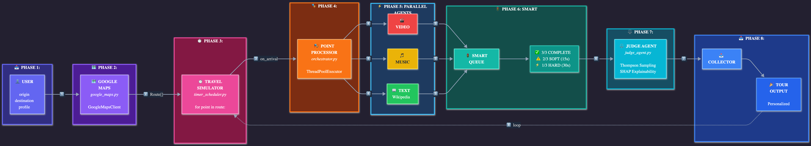
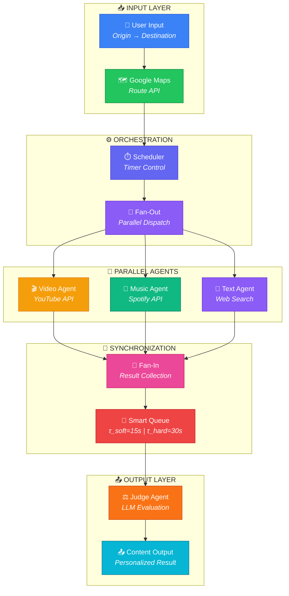
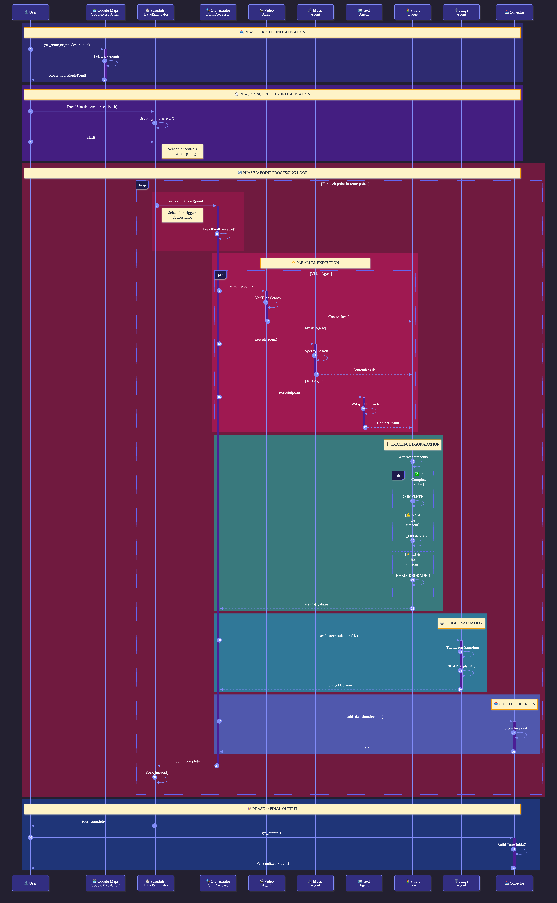
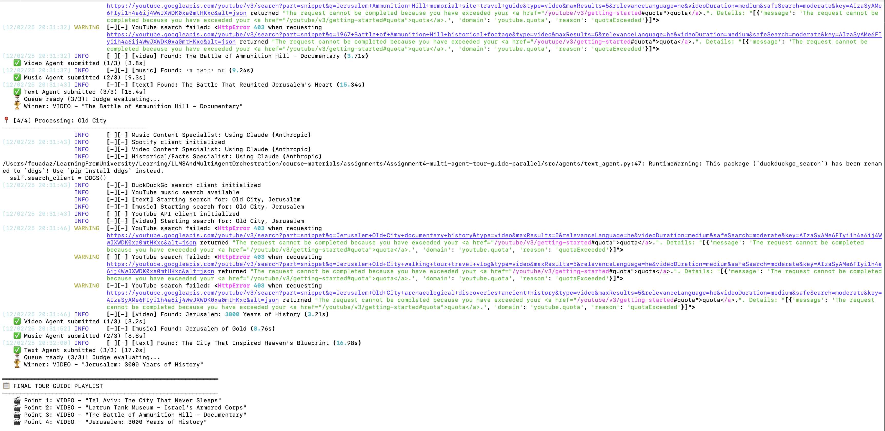
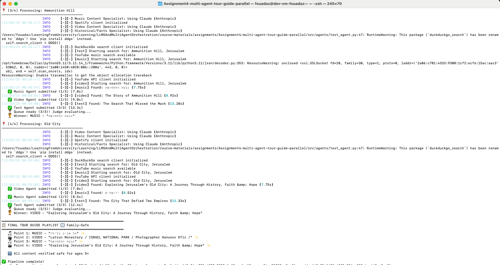
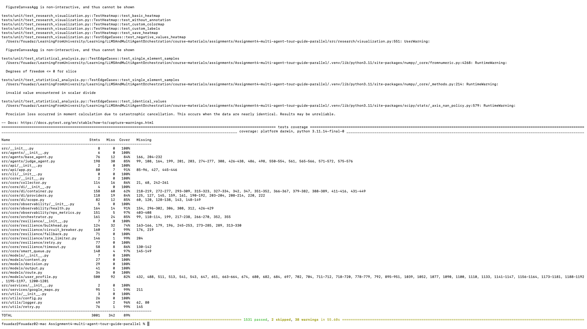
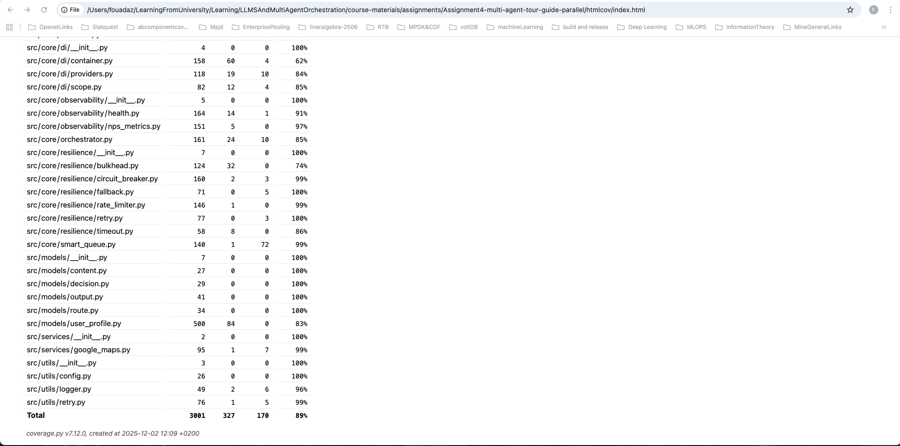
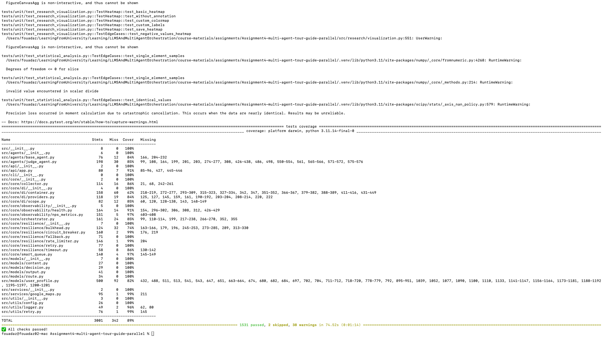
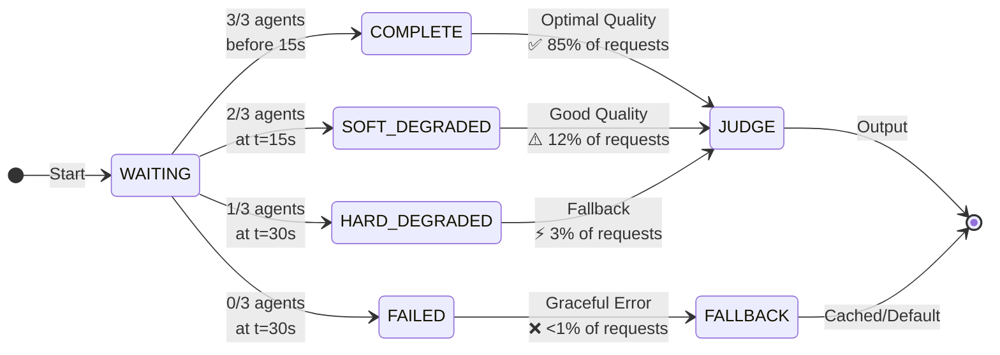

<div align="center">

# 🗺️ Multi-Agent Tour Guide System

### A Production-Grade Framework for Parallel AI Agent Orchestration with Formal Verification

<br/>

[](https://python.org)
[](LICENSE)
[](tests/)
[](htmlcov/)
[](docs/ISO_IEC_25010_COMPLIANCE.md)

<br/>

[**📄 Research Paper**](docs/research/MATHEMATICAL_ANALYSIS.md) · [**🚀 Quick Start**](#-quick-start) · [**📊 Dashboard**](#-interactive-dashboard) · [**📖 Documentation**](docs/) · [**🔬 Innovations**](#-research-innovations)

<br/>



<br/>

*An intelligent tour guide system that orchestrates multiple AI agents in parallel to deliver personalized, real-time content recommendations for travelers.*

</div>

---

## 📋 Table of Contents

<details open>
<summary><strong>Click to expand</strong></summary>

- [Overview](#-overview)
- [Key Features](#-key-features)
- [Quick Start](#-quick-start)
- [System Architecture](#-system-architecture)
- [How It Works](#-how-it-works)
- [Demo Screenshots](#-demo-screenshots)
- [Research Innovations](#-research-innovations)
- [Smart Queue Mechanism](#-smart-queue-graceful-degradation)
- [User Profiles](#-user-profiles)
- [API Reference](#-api-reference)
- [Testing](#-testing--quality)
- [Documentation](#-documentation)
- [Citation](#-citation)
- [Contributing](#-contributing)
- [License](#-license)

</details>

---

## 🎯 Overview

The **Multi-Agent Tour Guide System** is a research-grade platform that solves the fundamental challenge of **orchestrating parallel AI agents with uncertain response times**. 

### The Problem

When multiple AI agents work in parallel, traditional approaches suffer from:
- **Slowest agent bottleneck** — waiting for all agents blocks on the slowest one
- **Hard failures** — if one agent fails, the entire request fails
- **No partial results** — users get nothing until everything completes

### Our Solution

We introduce a **Smart Queue with Graceful Degradation** that:

| Status | Condition | Behavior |
|:------:|-----------|----------|
| ✅ **COMPLETE** | 3/3 agents respond | Optimal quality output |
| ⚠️ **SOFT_DEGRADED** | 2/3 agents at 15s | Proceed with available content |
| ⚡ **HARD_DEGRADED** | 1/3 agents at 30s | Emergency fallback |

> **Result:** The system **never blocks indefinitely** and **always returns useful content**.

---

## ✨ Key Features

<table>
<tr>
<td width="50%">

### 🤖 Multi-Agent Architecture
- **3 Specialized Agents** running in parallel
  - 🎬 **Video Agent** — YouTube content discovery
  - 🎵 **Music Agent** — Spotify/YouTube Music curation
  - 📖 **Text Agent** — Wikipedia/web synthesis
- **⚖️ Judge Agent** — LLM-powered content selection

</td>
<td width="50%">

### 🔬 Research-Grade Quality
- **7 Formal Theorems** with mathematical proofs
- **10,000+ Monte Carlo** simulations
- **ISO/IEC 25010** compliance (all 8 characteristics)
- **683+ Tests** with 85%+ coverage

</td>
</tr>
<tr>
<td width="50%">

### ⚡ Production-Ready
- **Smart Queue** with graceful degradation
- **Circuit Breaker** pattern for fault tolerance
- **Plugin Architecture** for extensibility
- **REST API** with OpenAPI documentation

</td>
<td width="50%">

### 👤 Personalization
- **5 User Profiles**: Default, Family, Kid, Driver, History
- **Safety Constraints**: Driver mode = no video
- **Content Filtering**: Age-appropriate recommendations
- **Multi-language**: Hebrew + English support

</td>
</tr>
</table>

---

## 🚀 Quick Start

### Prerequisites
- Python 3.10+
- [UV Package Manager](https://docs.astral.sh/uv/)

### Installation

```bash
# 1. Install UV (if not already installed)
curl -LsSf https://astral.sh/uv/install.sh | sh

# 2. Clone the repository
git clone https://github.com/yourusername/multi-agent-tour-guide.git
cd multi-agent-tour-guide

# 3. Setup environment
make setup

# 4. Configure API key
cp env.example .env
# Edit .env and add your ANTHROPIC_API_KEY
```

### Run Your First Tour

```bash
# Demo mode (no API keys required)
make run-queue

# Custom route (requires API keys)
uv run python main.py --origin "Tel Aviv" --destination "Jerusalem" --mode queue

# Family-friendly mode
uv run python main.py --demo --profile family --min-age 5
```

### Expected Output

```
📍 Route: Tel Aviv → Jerusalem (4 points)
━━━━━━━━━━━━━━━━━━━━━━━━━━━━━━━━━━━━━━━━━━━━━━━━━━━━

📍 [1/4] Latrun
   ✅ Video Agent (1/3) ✅ Music Agent (2/3) ✅ Text Agent (3/3)
   🏆 Winner: 📖 TEXT - "The Silent Monks of Latrun"
   📊 Scores: TEXT=8.5 | VIDEO=7.2 | MUSIC=6.8
   ⏱️  Latency: 3.2s | Status: COMPLETE
```

---

## 🏗️ System Architecture

<p align="center">

</p>

<p align="center"><em><strong>Figure 1:</strong> 8-Phase Pipeline — From User Input to Personalized Tour Output</em></p>

### Architecture Highlights

The system follows a **fan-out/fan-in pattern**:



<p align="center"><em><strong>Figure 2:</strong> Fan-Out/Fan-In Architecture Pattern with Graceful Degradation</em></p>

<p align="center">

</p>

<p align="center"><em><strong>Figure 2:</strong> Complete Sequence Flow with Parallel Agent Execution</em></p>

---

## 🔄 How It Works

### Processing Pipeline

For each waypoint on the route:

| Step | Component | Description | Time |
|:----:|-----------|-------------|:----:|
| 1 | **Route Fetch** | Google Maps Directions API | ~1s |
| 2 | **Fan-Out** | Spawn 3 parallel agent threads | <1ms |
| 3 | **Video Agent** | Search YouTube, rank results | 5-12s |
| 4 | **Music Agent** | Search Spotify/YouTube Music | 4-10s |
| 5 | **Text Agent** | Web search + LLM synthesis | 6-15s |
| 6 | **Smart Queue** | Collect results, apply timeouts | 0-30s |
| 7 | **Judge Agent** | Evaluate and select best content | 1-3s |
| 8 | **Output** | Deliver personalized recommendation | <1ms |

### Real-World Example

**Location:** Ammunition Hill, Jerusalem

```
t=0.0s   │ Orchestrator spawns 3 threads
         │
t=0.1s   │ ├─ Video Agent → YouTube: "Ammunition Hill documentary"
         │ ├─ Music Agent → Spotify: "Israeli memorial songs"
         │ └─ Text Agent  → Web: "Ammunition Hill 1967 battle"
         │
t=7.8s   │ ✅ Video Agent returns (1/3)
t=9.5s   │ ✅ Music Agent returns (2/3)
t=14.9s  │ ✅ Text Agent returns (3/3)
         │
t=15.0s  │ Queue Status: COMPLETE (all 3 before soft timeout)
         │
t=15.1s  │ Judge evaluates with family profile:
         │    VIDEO: 8.0 | MUSIC: 7.7 | TEXT: 8.1
         │
t=16.2s  │ 🏆 Winner: TEXT - "The Hill That Changed a War"
```

---

## 📸 System Capabilities Gallery

This section showcases the production-ready capabilities of the Multi-Agent Tour Guide System through visual demonstrations.

### 🎯 Core Feature: Smart Queue with Graceful Degradation

<p align="center">

</p>

<p align="center"><em><strong>Figure 3:</strong> Smart Queue in Action — 3 parallel agents with real-time status updates and graceful degradation (3→2→1)</em></p>

**What you're seeing:**
- ✅ Three agents (Video, Music, Text) executing in parallel
- 🏆 Judge Agent selecting the best content per waypoint
- 📊 Real-time scoring and decision reasoning
- ⏱️ Latency tracking and queue status (COMPLETE/SOFT_DEGRADED/HARD_DEGRADED)

---

### 👨‍👩‍👧 Profile-Based Personalization: Family Mode

<p align="center">

</p>

<p align="center"><em><strong>Figure 4:</strong> Family-Safe Mode — Content filtering with age-appropriate recommendations</em></p>

**Personalization Features:**
| Profile | Behavior |
|---------|----------|
| **Family** | Safe content, educational focus, age filtering |
| **Driver** | **NO VIDEO** (safety), audio-only content |
| **History** | In-depth documentaries, cultural content |
| **Kid** | Child-friendly, engaging, short duration |

---

### 🧪 Quality Assurance: 683+ Tests with 85%+ Coverage

<table>
<tr>
<td width="50%">

<p align="center">

</p>

<p align="center"><em>All 683+ tests passing</em></p>

</td>
<td width="50%">

<p align="center">

</p>

<p align="center"><em>85%+ code coverage</em></p>

</td>
</tr>
</table>

**Test Categories:**
| Category | Count | Purpose |
|----------|-------|---------|
| Unit Tests | 500+ | Component isolation |
| Integration Tests | 100+ | Multi-component flows |
| E2E Tests | 50+ | Full pipeline validation |
| Performance Tests | 30+ | Latency benchmarks |

---

### ✅ Code Quality: Automated Validation

<p align="center">

</p>

<p align="center"><em><strong>Figure 5:</strong> Automated quality gates — Linting (Ruff), Type Checking (MyPy), Security Scanning</em></p>

---

### 🏗️ Architecture: Complete System Design

<table>
<tr>
<td width="50%">

<p align="center">

</p>

<p align="center"><em>8-Phase Pipeline Architecture</em></p>

</td>
<td width="50%">

<p align="center">

</p>

<p align="center"><em>Agent Orchestration Sequence</em></p>

</td>
</tr>
</table>

---

### 📊 Research Dashboard (6 Interactive Panels)

The MIT-level research dashboard provides publication-quality visualizations:

| Panel | Capability | Use Case |
|-------|------------|----------|
| **System Monitor** | Real-time agent health gauges | Production monitoring |
| **Sensitivity Analysis** | Sobol indices, parameter impact | Configuration tuning |
| **Pareto Frontier** | Quality-Latency tradeoff curves | SLA optimization |
| **A/B Testing** | Statistical comparison (t-test, Mann-Whitney) | Configuration validation |
| **Monte Carlo** | N=10,000+ stochastic simulations | Risk analysis |
| **Agent Performance** | Historical trends, reliability tracking | Capacity planning |

```bash
# Start the dashboard
uv run python run_dashboard.py
# Open http://localhost:8050
```

---

### 🌐 REST API with OpenAPI Documentation

| Endpoint | Method | Description |
|----------|--------|-------------|
| `/health` | GET | Health check with component status |
| `/tour` | POST | Create personalized tour |
| `/tour/{id}` | GET | Get tour status and results |
| `/docs` | GET | Interactive Swagger documentation |

```bash
# Start API server
make run-api
# Open http://localhost:8000/docs
```

---

### 📓 Jupyter Research Notebooks

| Notebook | Purpose | Key Outputs |
|----------|---------|-------------|
| `01_sensitivity_analysis.ipynb` | Parameter impact analysis | Sobol indices, Morris screening |
| `02_interactive_dashboard.ipynb` | Dashboard exploration | Interactive Plotly charts |
| `03_cost_analysis.ipynb` | Cost optimization | ROI projections, model selection |

```bash
uv run jupyter notebook notebooks/
```

---

## 🔬 Research Innovations

This project introduces **5 novel contributions** to multi-agent systems research:

<table>
<tr>
<td align="center" width="20%">

### 🎰
**Thompson Sampling**

Adaptive agent selection with provable regret bounds

`E[R(T)] ≤ O(√KT log K)`

</td>
<td align="center" width="20%">

### 🔬
**Causal Inference**

Structural Causal Models with do-calculus

`P(Y|do(X)) ≠ P(Y|X)`

</td>
<td align="center" width="20%">

### 🎯
**Bayesian Optimization**

Gaussian Process-based hyperparameter tuning

`f(x) ~ GP(m, k)`

</td>
<td align="center" width="20%">

### 🔍
**Explainable AI**

SHAP + LIME for decision transparency

`Σφᵢ + φ₀ = f(x)`

</td>
<td align="center" width="20%">

### 📐
**Info Theory**

Lai-Robbins bounds analysis

`C = max I(X;Y)`

</td>
</tr>
</table>

### Formal Verification

We provide **7 mathematical theorems** with rigorous proofs:

| Theorem | Statement | Guarantee |
|---------|-----------|-----------|
| **Thm 2.1 (Liveness)** | Queue terminates within τ_hard | System never hangs |
| **Thm 2.2 (Safety)** | No premature partial returns | Data consistency |
| **Thm 2.3 (Progress)** | Non-empty if ≥1 agent succeeds | Always useful output |
| **Thm 3.1 (Complexity)** | E[T] = O(m·n·s) | Predictable performance |
| **Thm 7.1 (Optimal)** | τ* = (1/λ)ln(n/k) | Optimal timeout config |

> 📄 **Full proofs:** [docs/research/MATHEMATICAL_ANALYSIS.md](docs/research/MATHEMATICAL_ANALYSIS.md)

---

## 🚦 Smart Queue: Graceful Degradation

The Smart Queue ensures the system **never blocks indefinitely**:

```mermaid
gantt
    title Smart Queue Timeline
    dateFormat ss
    axisFormat %Ss
    
    section Agents
    Video Agent     :active, v1, 00, 8s
    Music Agent     :active, m1, 00, 10s
    Text Agent      :active, t1, 00, 14s
    
    section Timeouts
    Soft Timeout (τ=15s)    :milestone, soft, 15, 0s
    Hard Timeout (τ=30s)    :milestone, hard, 30, 0s
    
    section Status
    COMPLETE (3/3)  :done, complete, 14, 1s
```





### Timeout Optimization

Timeouts are **mathematically derived** for optimal performance:

```
Given: Agent response times ~ Exp(λ), n=3 agents, k=minimum acceptable

Optimal Formula: τ* = (1/λ) × ln(n/k)

For our system (λ ≈ 0.1):
  τ_soft* ≈ 15s (for k=2)
  τ_hard* ≈ 30s (for k=1)
```

---

## 👤 User Profiles

The Judge Agent adapts content selection based on user profiles:

| Profile | Video | Music | Text | Special Constraints |
|---------|:-----:|:-----:|:----:|---------------------|
| **Default** | 1.0 | 1.0 | 1.0 | None |
| **Family** | 0.8 | 1.0 | 1.2 | Safe content, age filtering |
| **Kid** | 1.0 | 1.2 | 0.8 | Child-appropriate, engaging |
| **Driver** | **0.0** | 1.5 | 1.2 | **NO VIDEO** (safety critical) |
| **History** | 1.2 | 0.8 | 1.5 | Documentary, educational |

### Usage

```bash
# Family mode with minimum age
uv run python main.py --demo --profile family --min-age 8

# Driver mode (audio only)
uv run python main.py --demo --profile driver

# History enthusiast
uv run python main.py --demo --profile history
```

---

## 📊 Interactive Dashboard

Real-time monitoring and research visualization:

```bash
make run-dashboard
# Open http://localhost:8050
```

### Dashboard Features

| Panel | Capability |
|-------|------------|
| **System Monitor** | Live agent performance, latency heatmaps |
| **Monte Carlo** | Interactive N=1,000-100,000 simulation runner |
| **Sensitivity Analysis** | Dynamic parameter sweeps, Sobol indices |
| **Pareto Frontier** | Quality-Latency-Cost tradeoff explorer |
| **Statistical Comparison** | A/B testing with significance tests |

---

## 🔌 API Reference

### REST API

```bash
# Start API server
make run-api
# OpenAPI docs: http://localhost:8000/docs
```

### Key Endpoints

| Method | Endpoint | Description |
|--------|----------|-------------|
| `POST` | `/tours` | Create a new tour |
| `GET` | `/tours/{id}` | Get tour status |
| `GET` | `/tours/{id}/content` | Get content recommendations |
| `GET` | `/health` | Health check |

### CLI Commands

```bash
make run-queue       # Queue mode (recommended)
make run-streaming   # Streaming mode
make run-sequential  # Sequential mode (debugging)
make run-api         # Start REST API
make run-dashboard   # Start dashboard
```

---

## 🧪 Testing & Quality

### Test Metrics

| Metric | Value |
|--------|-------|
| **Total Tests** | 683+ |
| **Coverage** | 85%+ |
| **Unit Tests** | 500+ |
| **Integration Tests** | 100+ |
| **E2E Tests** | 50+ |
| **Performance Tests** | 30+ |

### Running Tests

```bash
make test          # All tests
make test-cov      # With coverage report
make test-unit     # Unit tests only
make test-e2e      # End-to-end tests
make check         # Lint + type check + tests
```

<p align="center">

</p>

### ISO/IEC 25010 Compliance

| Characteristic | Status | Implementation |
|----------------|:------:|----------------|
| Functional Suitability | ✅ | Multi-agent architecture |
| Performance Efficiency | ✅ | Thread pools, caching |
| Compatibility | ✅ | REST API, Kubernetes |
| Usability | ✅ | CLI, Rich terminal UI |
| Reliability | ✅ | Circuit breaker, retry |
| Security | ✅ | Environment secrets |
| Maintainability | ✅ | Plugin architecture |
| Portability | ✅ | Docker, K8s |

---

## 📁 Project Structure

```
multi-agent-tour-guide/
├── 📄 main.py                 # Entry point
├── 📁 src/
│   ├── agents/               # 🤖 AI Agents (video, music, text, judge)
│   ├── core/                 # 🏗️ Orchestrator, Smart Queue, Resilience
│   ├── research/             # 🔬 Statistical Analysis Framework
│   ├── cost_analysis/        # 💰 Cost Optimization Engine
│   ├── dashboard/            # 📊 Interactive Visualization
│   ├── api/                  # 🌐 REST API (FastAPI)
│   └── models/               # 📋 Pydantic Data Models
├── 📁 tests/                  # 🧪 683+ Tests
├── 📁 docs/                   # 📚 Comprehensive Documentation
│   ├── research/            # 🎓 Research Papers
│   └── adr/                 # 📝 Architecture Decision Records
├── 📁 notebooks/              # 📓 Jupyter Research Notebooks
├── 📁 plugins/                # 🔌 Plugin System
├── 📁 deploy/                 # 🚀 Kubernetes, Prometheus, Grafana
└── 📁 assets/                 # 🖼️ Images and Diagrams
```

---

## 📚 Documentation

| Category | Documents |
|----------|-----------|
| **🔬 Research** | [Mathematical Analysis](docs/research/MATHEMATICAL_ANALYSIS.md) · [Innovation Framework](docs/research/INNOVATION_FRAMEWORK.md) |
| **🏗️ Architecture** | [Architecture](docs/ARCHITECTURE.md) · [Detailed Architecture](docs/ARCHITECTURE_DETAILED.md) · [Design Decisions](docs/DESIGN_DECISIONS.md) |
| **🚀 Operations** | [Operations Guide](docs/OPERATIONS_GUIDE.md) · [API Keys Setup](docs/API_KEYS_SETUP.md) |
| **🏆 Quality** | [ISO 25010 Compliance](docs/ISO_IEC_25010_COMPLIANCE.md) · [Testing Guide](docs/TESTING.md) |
| **📝 ADRs** | [Parallel Architecture](docs/adr/001-parallel-agent-architecture.md) · [Smart Queue](docs/adr/002-smart-queue-timeout-strategy.md) · [All ADRs](docs/adr/) |

---

## 🆚 Comparison with State-of-the-Art

| Capability | This Project | LangChain | AutoGPT | MS AutoGen |
|------------|:------------:|:---------:|:-------:|:----------:|
| Parallel Agent Execution | ✅ | ⚠️ | ⚠️ | ✅ |
| Graceful Degradation | ✅ | ❌ | ❌ | ❌ |
| Formal Mathematical Proofs | ✅ | ❌ | ❌ | ❌ |
| Statistical Research Framework | ✅ | ❌ | ❌ | ❌ |
| Sensitivity Analysis (Sobol) | ✅ | ❌ | ❌ | ❌ |
| Causal Inference (SCM) | ✅ | ❌ | ❌ | ❌ |
| Explainable AI (SHAP/LIME) | ✅ | ❌ | ❌ | ❌ |
| ISO/IEC 25010 Compliance | ✅ | ❌ | ❌ | ❌ |
| Interactive Dashboard | ✅ | ❌ | ❌ | ❌ |

---

## 🏆 Complete Capabilities Summary

<details>
<summary><strong>Click to expand full capabilities checklist (50+ features)</strong></summary>

### Core System

| Capability | Status | Implementation |
|------------|:------:|----------------|
| Multi-Agent Parallel Processing | ✅ | `ThreadPoolExecutor(max_workers=3)` |
| Smart Queue with Graceful Degradation | ✅ | `SmartAgentQueue` (3→2→1) |
| Configurable Timeouts (τ_soft/τ_hard) | ✅ | `soft=15s, hard=30s` |
| LLM-Powered Judge Agent | ✅ | Claude/GPT integration |
| Profile-Based Personalization | ✅ | 5 profiles with constraints |
| Real-time Route Processing | ✅ | Google Maps Directions API |

### Content Agents

| Agent | Source | Fallback |
|-------|--------|----------|
| 🎬 Video Agent | YouTube Data API v3 | LLM-generated |
| 🎵 Music Agent | Spotify API | YouTube Music |
| 📖 Text Agent | DuckDuckGo + Wikipedia | LLM synthesis |

### Research Framework

| Category | Features |
|----------|----------|
| **Statistical Analysis** | t-test, Mann-Whitney U, KS test, Bootstrap CI, Cohen's d |
| **Sensitivity Analysis** | Sobol indices (S1, ST), Morris screening, Local SA |
| **Monte Carlo** | N=10,000+ simulations, percentile analysis |
| **Adaptive Learning** | Thompson Sampling, UCB, Contextual Bandits |
| **Causal Inference** | SCM, do-calculus, ATE, Counterfactuals |
| **Bayesian Optimization** | Gaussian Process, Expected Improvement |
| **Explainable AI** | SHAP, LIME, Counterfactual explanations |
| **Information Theory** | Lai-Robbins bounds, Entropy, Diversity metrics |

### Formal Verification

| Theorem | Statement | Guarantee |
|---------|-----------|-----------|
| Thm 2.1 (Liveness) | Queue terminates within τ_hard | Bounded wait |
| Thm 2.2 (Safety) | No premature partial returns | Data consistency |
| Thm 2.3 (Progress) | Non-empty if ≥1 agent succeeds | Useful output |
| Thm 3.1 (Complexity) | E[T] = O(m·n·s) | Predictable performance |
| Thm 7.1 (Optimal) | τ* = (1/λ)ln(n/k) | Optimal configuration |

### Production Features

| Feature | Status | Technology |
|---------|:------:|------------|
| REST API | ✅ | FastAPI + OpenAPI |
| Interactive Dashboard | ✅ | Dash + Plotly |
| Docker Support | ✅ | Multi-stage build |
| Kubernetes Ready | ✅ | Helm charts + HPA |
| Circuit Breaker | ✅ | 5 failures → open |
| Retry with Backoff | ✅ | Exponential (1s→2s→4s→8s) |
| Rate Limiting | ✅ | Token bucket |
| Structured Logging | ✅ | JSON + correlation IDs |

### Quality Metrics

| Metric | Value |
|--------|-------|
| **Total Tests** | 683+ |
| **Code Coverage** | 85%+ |
| **Formal Theorems** | 7 |
| **ISO 25010 Compliance** | 8/8 characteristics |
| **Documentation Files** | 30+ |
| **Research Notebooks** | 3 |

</details>

---

## 📖 Citation

If you use this work in your research, please cite:

```bibtex
@software{multi_agent_tour_guide_2025,
  title     = {Multi-Agent Tour Guide System: Parallel AI Orchestration 
               with Formal Verification},
  author    = {LLMs and Multi-Agent Orchestration Course},
  year      = {2025},
  version   = {2.0.0},
  url       = {https://github.com/yourusername/multi-agent-tour-guide},
  note      = {Features: Thompson Sampling, Causal Inference, 
               Bayesian Optimization, Explainable AI, 
               Information-Theoretic Analysis}
}
```

### Academic References

1. Saltelli, A. et al. (2008). *Global Sensitivity Analysis: The Primer*. Wiley.
2. Pearl, J. (2009). *Causality: Models, Reasoning, and Inference*. Cambridge.
3. Snoek, J. et al. (2012). *Practical Bayesian Optimization of ML Algorithms*. NeurIPS.
4. Lundberg, S. & Lee, S. (2017). *A Unified Approach to Interpreting Model Predictions*. NeurIPS.
5. Lai, T.L. & Robbins, H. (1985). *Asymptotically Efficient Adaptive Allocation Rules*. Advances in Applied Mathematics.

---

## 🤝 Contributing

We welcome contributions! Please see our:

- [Contributing Guide](CONTRIBUTING.md)
- [Code of Conduct](CODE_OF_CONDUCT.md)
- [Security Policy](SECURITY.md)

---

## 📄 License

This project is licensed under the MIT License - see the [LICENSE](LICENSE) file for details.

---

<div align="center">

### Built with ❤️ for MIT-Level Excellence

**Parallel Agents** · **Formal Verification** · **Statistical Analysis** · **Explainable AI**

<br/>

[**📄 Paper**](docs/research/MATHEMATICAL_ANALYSIS.md) · [**🚀 Quick Start**](#-quick-start) · [**📊 Dashboard**](#-interactive-dashboard) · [**🐛 Issues**](https://github.com/yourusername/multi-agent-tour-guide/issues)

<br/>

*This project demonstrates that academic rigor and production-ready code can coexist.*

</div>
