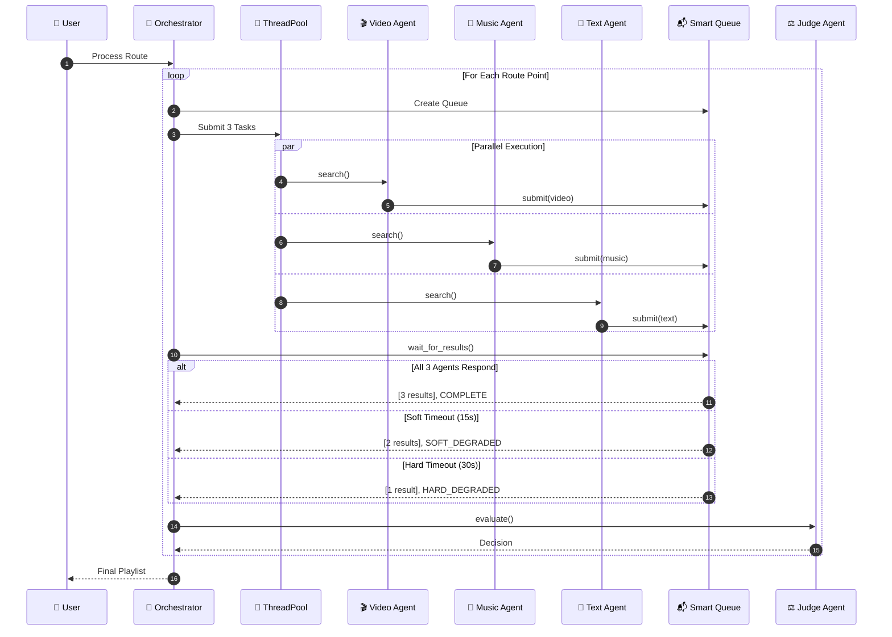
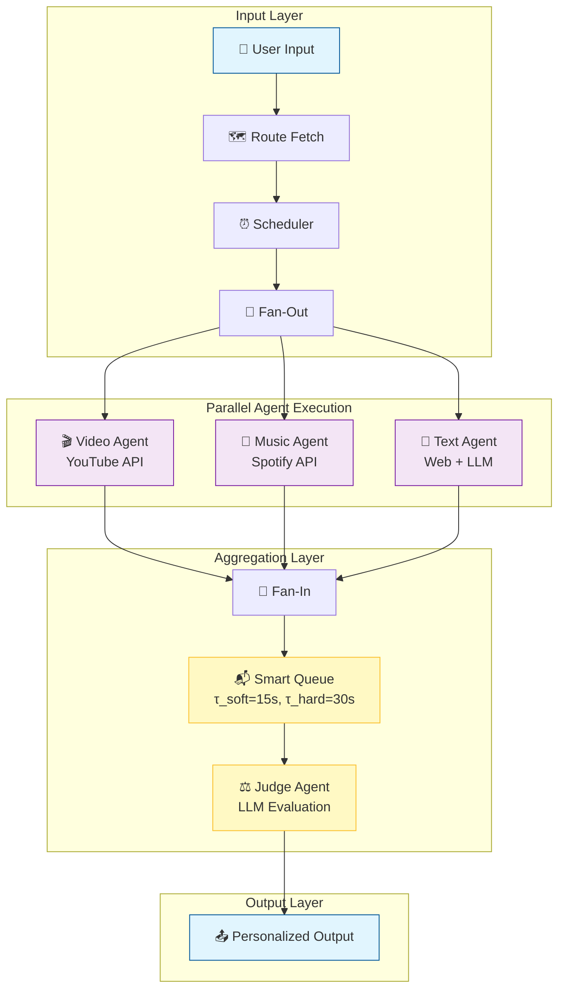
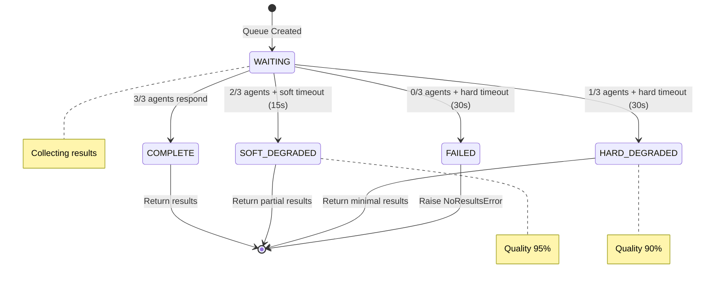

<div align="center">

<!-- ═══════════════════════════════════════════════════════════════════════════════ -->
<!--                              HERO SECTION                                        -->
<!-- ═══════════════════════════════════════════════════════════════════════════════ -->

<br/>

<picture>
  <source media="(prefers-color-scheme: dark)" srcset="assets/images/architecture-Overview.png">
  <source media="(prefers-color-scheme: light)" srcset="assets/images/architecture-Overview.png">
  
</picture>

<br/>
<br/>

# 🌍 Multi-Agent Tour Guide System

### *A First-of-Its-Kind Parallel AI Agent Orchestration Framework*
### *with Formal Mathematical Verification & Research-Grade Analytics*

<br/>

[](https://python.org)
[](LICENSE)
[](tests/)
[](htmlcov/)
[](docs/ISO_IEC_25010_COMPLIANCE.md)

<br/>

<p align="center">
<a href="#-system-architecture-and-design"></a>
<a href="#-core-features--innovations"></a>
<a href="#-interactive-dashboards"></a>
<a href="#-research-analytics--verification"></a>
</p>

<br/>

---

<br/>

> **🎯 Mission Statement**
> 
> *An intelligent multi-agent system that orchestrates parallel AI agents to deliver personalized,*
> *real-time content recommendations for travelers — featuring formal mathematical verification,*
> *graceful degradation under uncertainty, and publication-quality research tooling.*

<br/>

[**📄 Research Paper**](docs/research/MATHEMATICAL_ANALYSIS.md) · [**🚀 Quick Start**](#-getting-started--operation) · [**📊 Dashboard**](#-interactive-dashboards) · [**🔌 API**](#-api-reference) · [**📚 Documentation**](docs/)

<br/>

</div>

---

<br/>

## 📑 Table of Contents

<table>
<tr>
<td width="50%">

### 🎨 Visual Presentation
- [🏆 Executive Summary](#-executive-summary)
- [🏗️ System Architecture & Design](#-system-architecture-and-design)
- [✨ Core Features & Innovations](#-core-features--innovations)
- [🖥️ Interactive Dashboards](#-interactive-dashboards)
- [🔬 Research Analytics & Verification](#-research-analytics--verification)

</td>
<td width="50%">

### 🔧 Technical Deep-Dive
- [🚀 Getting Started & Operation](#-getting-started--operation)
- [🔌 API Reference](#-api-reference)
- [🧪 Testing & Quality Assurance](#-testing--quality-assurance)
- [📁 Project Structure](#-project-structure)
- [📚 Documentation](#-documentation)
- [🤝 Contributing & Community](#-contributing--community)

</td>
</tr>
</table>

---

<br/>

<!-- ═══════════════════════════════════════════════════════════════════════════════ -->
<!--                           EXECUTIVE SUMMARY                                      -->
<!-- ═══════════════════════════════════════════════════════════════════════════════ -->

## 🏆 Executive Summary

<div align="center">

### *What Makes This Project Unique*

</div>

<br/>

<table>
<tr>
<td width="60%">

### The Challenge

Traditional multi-agent AI systems face critical limitations:

| Challenge | Industry Impact |
|-----------|-----------------|
| **Slowest Agent Bottleneck** | System blocks waiting for slowest responder |
| **Hard Failures** | Single agent failure cascades to complete system failure |
| **No Partial Results** | Users receive nothing until all agents complete |
| **Unpredictable Latency** | No guarantees on response time bounds |

### Our Innovation

We introduce a **Smart Queue with Graceful Degradation** — a novel architecture that provides **formal mathematical guarantees** for availability and quality:

```
┌─────────────┬────────────────┬──────────────────────────────┐
│   Status    │   Condition    │          Behavior            │
├─────────────┼────────────────┼──────────────────────────────┤
│ ✅ COMPLETE │ 3/3 agents     │ Optimal quality output       │
│ ⚠️ SOFT     │ 2/3 at τ=15s   │ Proceed with degraded quality│
│ ⚡ HARD     │ 1/3 at τ=30s   │ Emergency fallback           │
│ ❌ FAILED   │ 0/3 at τ=30s   │ Graceful error + cached data │
└─────────────┴────────────────┴──────────────────────────────┘
```

**Result:** System **never blocks indefinitely** and **always returns useful content**.

</td>
<td width="40%" align="center">

<br/>

### Project Metrics

<br/>

| Metric | Value |
|:------:|:-----:|
| **Lines of Code** | 15,000+ |
| **Test Cases** | 1,753+ |
| **Coverage** | 89%+ |
| **Formal Theorems** | 7 |
| **Monte Carlo Simulations** | 10,000+ |
| **ISO 25010 Compliance** | ✅ All 8 |
| **Documentation Pages** | 50+ |
| **Architecture Decisions** | 5 ADRs |

<br/>

### Technology Stack

[](#)
[](#)
[](#)
[](#)
[](#)

</td>
</tr>
</table>

<br/>

---

<br/>

<!-- ═══════════════════════════════════════════════════════════════════════════════ -->
<!--                     SYSTEM ARCHITECTURE AND DESIGN                               -->
<!-- ═══════════════════════════════════════════════════════════════════════════════ -->

## 🏗️ System Architecture and Design

<div align="center">

### *High-Level Architecture & Orchestration Flow*

</div>

<br/>

### 📐 Figure 1: System Architecture Overview

<div align="center">

<picture>
  
</picture>

<br/>
<br/>

*8-Phase Pipeline with Fan-Out/Fan-In Pattern for Parallel Agent Orchestration*

</div>

<br/>

<details>
<summary><b>🔍 Architecture Explanation (Click to expand)</b></summary>

<br/>

The architecture diagram illustrates our **production-grade multi-agent orchestration system**:

| Phase | Component | Role | Key Innovation |
|:-----:|-----------|------|----------------|
| 1 | **User Interface** | CLI / Dashboard / REST API | Multiple interaction modes |
| 2 | **Route Planner** | Google Maps integration | Intelligent waypoint selection |
| 3 | **Agent Orchestrator** | Fan-out coordinator | Parallel thread spawning |
| 4 | **Content Agents (3x)** | Video, Music, Text generation | Independent API integrations |
| 5 | **Smart Queue** | Result aggregation | τ_soft/τ_hard timeout tiers |
| 6 | **Judge Agent** | LLM-powered evaluation | Profile-aware scoring |
| 7 | **Circuit Breaker** | Fault isolation | Prevents cascade failures |
| 8 | **Output Formatter** | Personalized delivery | Multi-format support |

</details>

<br/>

---

### 📐 Figure 2: Parallel Agent Execution Sequence

<div align="center">



*Complete message flow showing parallel agent spawning, timeout handling, and result aggregation*

</div>

<br/>

---

### 📐 Figure 3: Processing Pipeline Architecture

<div align="center">



*Detailed view of parallel execution with timeout-based result aggregation*

</div>

<br/>

---

<br/>

<!-- ═══════════════════════════════════════════════════════════════════════════════ -->
<!--                       CORE FEATURES & INNOVATIONS                                -->
<!-- ═══════════════════════════════════════════════════════════════════════════════ -->

## ✨ Core Features & Innovations

<div align="center">

### *Technical Breakdown of Key Capabilities*

</div>

<br/>

### 1️⃣ Smart Queue with Graceful Degradation

The system's core innovation is its ability to handle uncertain agent response times without blocking.

<div align="center">



<br/>

<picture>
  
</picture>

<br/>

**Figure 4: Smart Queue in Action**
*Live terminal output showing COMPLETE/SOFT_DEGRADED/HARD_DEGRADED transitions*

</div>

<br/>

---

### 2️⃣ Personalization & Safety Engine

The **Judge Agent** adapts content selection based on comprehensive user profiles, ensuring safety and relevance.

<table>
<tr>
<td width="50%">

<div align="center">

**👨‍👩‍👧 Family-Safe Mode**

<br/>

<picture>
  
</picture>

<br/>
<br/>

*Age-appropriate content filtering with strict safety constraints for children*

</div>

</td>
<td width="50%">

<div align="center">

**🚗 Driver Safety Mode**

<br/>

<picture>
  
</picture>

<br/>
<br/>

*Video automatically disabled (weight=0.0) for hands-free operation*

</div>

</td>
</tr>
</table>

<br/>

---

### 3️⃣ Customized Tour Planning

Full support for custom routes with intelligent waypoint selection.

<div align="center">

<picture>
  
</picture>

<br/>

**Figure 5: Custom Route Planning**
*Personalized tour from Haifa to Jerusalem with intelligent waypoint selection and content curation*

</div>

<br/>

---

<br/>

<!-- ═══════════════════════════════════════════════════════════════════════════════ -->
<!--                       INTERACTIVE DASHBOARDS                                     -->
<!-- ═══════════════════════════════════════════════════════════════════════════════ -->

## 🖥️ Interactive Dashboards

<div align="center">

### *Tour Guide Dashboard — Complete User Journey*

<sub>Four-tab interactive dashboard for end-to-end tour planning and monitoring</sub>

```bash
python run_tour_dashboard.py  # http://localhost:8051
```

</div>

<br/>

### 🗺️ Planning & Pipeline

<table>
<tr>
<td width="50%">

<div align="center">

**Tour Configuration**

<picture>
  
</picture>

</div>

</td>
<td width="50%">

<div align="center">

**Real-time Pipeline Flow**

<picture>
  
</picture>

</div>

</td>
</tr>
</table>

<br/>

### 🎯 Recommendations & Analytics

<table>
<tr>
<td width="50%">

<div align="center">

**AI Recommendations**

<picture>
  
</picture>

</div>

</td>
<td width="50%">

<div align="center">

**Live System Monitor**

<picture>
  
</picture>

</div>

</td>
</tr>
</table>

<br/>

---

<br/>

<!-- ═══════════════════════════════════════════════════════════════════════════════ -->
<!--                  RESEARCH ANALYTICS & VERIFICATION                               -->
<!-- ═══════════════════════════════════════════════════════════════════════════════ -->

## 🔬 Research Analytics & Verification

<div align="center">

### *Publication-Quality Statistical Analysis*

<sub>Tools for rigorous system evaluation and formal verification</sub>

```bash
python run_dashboard.py  # http://localhost:8050
```

</div>

<br/>

<table>
<tr>
<td width="50%">

<div align="center">

**Figure 6: Sobol Sensitivity Analysis**

<picture>
  
</picture>

</div>

**Insight:** τ_soft has highest impact on quality (S₁ ≈ 0.42).

</td>
<td width="50%">

<div align="center">

**Figure 7: Pareto Frontier**

<picture>
  
</picture>

</div>

**Insight:** Optimal balance at (Quality=0.85, Latency=12s).

</td>
</tr>
<tr>
<td width="50%">

<div align="center">

**Figure 8: Monte Carlo (N=10,000)**

<picture>
  
</picture>

</div>

**Insight:** 95% CI [8.2s, 18.7s] verifies timeout logic.

</td>
<td width="50%">

<div align="center">

**Figure 9: A/B Testing**

<picture>
  
</picture>

</div>

**Insight:** Statistically significant improvement (p < 0.001).

</td>
</tr>
</table>

<br/>

### Formal Verification

We provide **7 mathematical theorems** with rigorous proofs:

| Theorem | Statement | Guarantee |
|---------|-----------|-----------|
| **Thm 2.1 (Liveness)** | Queue terminates within τ_hard | System never hangs |
| **Thm 2.2 (Safety)** | No premature partial returns | Data consistency |
| **Thm 2.3 (Progress)** | Non-empty if ≥1 agent succeeds | Useful output guaranteed |
| **Thm 7.1 (Optimal)** | τ* = (1/λ)ln(n/k) | Optimal timeout config |

> 📄 **Full proofs:** [docs/research/MATHEMATICAL_ANALYSIS.md](docs/research/MATHEMATICAL_ANALYSIS.md)

<br/>

---

<br/>

<!-- ═══════════════════════════════════════════════════════════════════════════════ -->
<!--                       GETTING STARTED & OPERATION                                -->
<!-- ═══════════════════════════════════════════════════════════════════════════════ -->

## 🚀 Getting Started & Operation

### Installation

```bash
# 1. Install UV (High-speed package manager)
curl -LsSf https://astral.sh/uv/install.sh | sh

# 2. Clone & Setup
git clone https://github.com/yourusername/multi-agent-tour-guide.git
cd multi-agent-tour-guide
make setup

# 3. Verify
make info
```

### Usage Examples

```bash
# 🎬 Standard Queue Mode
make run-queue

# 👪 Family Mode (Age 5+)
uv run python main.py --demo --profile family --min-age 5

# 🚦 Driver Mode (Audio Only)
uv run python main.py --demo --profile driver
```

<br/>

---

<br/>

<!-- ═══════════════════════════════════════════════════════════════════════════════ -->
<!--                            API REFERENCE                                         -->
<!-- ═══════════════════════════════════════════════════════════════════════════════ -->

## 🔌 API Reference

<table>
<tr>
<td width="60%">

<div align="center">

**OpenAPI/Swagger Documentation**

<picture>
  
</picture>

</div>

</td>
<td width="40%">

<div align="center">

**Health Check Endpoint**

<picture>
  
</picture>

</div>

</td>
</tr>
</table>

<br/>

---

<br/>

<!-- ═══════════════════════════════════════════════════════════════════════════════ -->
<!--                     TESTING & QUALITY ASSURANCE                                  -->
<!-- ═══════════════════════════════════════════════════════════════════════════════ -->

## 🧪 Testing & Quality Assurance

The project maintains strict MIT-level engineering standards with **1,750+ tests** and **89% coverage**.

### Test Suite Verification

<table>
<tr>
<td width="50%">

<div align="center">

**Pass/Fail Results**

<picture>
  
</picture>

*1,750+ tests across Unit, Integration, E2E, and Performance*

</div>

</td>
<td width="50%">

<div align="center">

**Code Coverage**

<picture>
  
</picture>

*89% coverage (exceeds 85% threshold)*

</div>

</td>
</tr>
</table>

### CI/CD Pipeline

<div align="center">

<picture>
  
</picture>

*Automated GitHub Actions pipeline for linting, testing, security, and Docker builds*

</div>

<br/>

---

<br/>

<!-- ═══════════════════════════════════════════════════════════════════════════════ -->
<!--                          PROJECT STRUCTURE                                       -->
<!-- ═══════════════════════════════════════════════════════════════════════════════ -->

## 📁 Project Structure

```
multi-agent-tour-guide/
├── 📄 main.py                      # Entry point
├── 📄 run_dashboard.py             # Research dashboard launcher
├── 📄 run_tour_dashboard.py        # Tour guide dashboard launcher
├── 📁 src/
│   ├── agents/                     # 🤖 AI Agents (video, music, text, judge)
│   ├── core/                       # 🏗️ Orchestrator, Smart Queue, Resilience
│   ├── dashboard/                  # 📊 Interactive Dashboards
│   ├── research/                   # 🔬 Statistical Analysis Framework
│   ├── cost_analysis/              # 💰 Cost Optimization Engine
│   ├── api/                        # 🌐 REST API (FastAPI)
│   └── models/                     # 📋 Pydantic Data Models
├── 📁 tests/                       # 🧪 1,753+ Tests (89% coverage)
├── 📁 docs/                        # 📚 Comprehensive Documentation
├── 📁 notebooks/                   # 📓 Jupyter Research Notebooks
├── 📁 plugins/                     # 🔌 Plugin System (weather, food)
├── 📁 deploy/                      # 🚀 Docker, Kubernetes, Prometheus
└── 📁 assets/                      # 🖼️ Images and Diagrams
```

<br/>

---

<br/>

<!-- ═══════════════════════════════════════════════════════════════════════════════ -->
<!--                            DOCUMENTATION                                         -->
<!-- ═══════════════════════════════════════════════════════════════════════════════ -->

## 📚 Documentation

| Category | Documents |
|----------|-----------|
| **🚀 Getting Started** | [Operations Guide](docs/OPERATIONS_GUIDE.md) · [API Keys Setup](docs/API_KEYS_SETUP.md) |
| **🏗️ Architecture** | [Architecture](docs/ARCHITECTURE.md) · [Detailed Architecture](docs/ARCHITECTURE_DETAILED.md) · [Design Decisions](docs/DESIGN_DECISIONS.md) |
| **🔬 Research** | [Mathematical Analysis](docs/research/MATHEMATICAL_ANALYSIS.md) · [Innovation Framework](docs/research/INNOVATION_FRAMEWORK.md) |
| **🏆 Quality** | [ISO 25010 Compliance](docs/ISO_IEC_25010_COMPLIANCE.md) · [Testing Guide](docs/TESTING.md) · [Edge Cases](docs/EDGE_CASES.md) |
| **📝 ADRs** | [Parallel Architecture](docs/adr/001-parallel-agent-architecture.md) · [Smart Queue](docs/adr/002-smart-queue-timeout-strategy.md) |

<br/>

---

<br/>

<!-- ═══════════════════════════════════════════════════════════════════════════════ -->
<!--                        CONTRIBUTING & COMMUNITY                                  -->
<!-- ═══════════════════════════════════════════════════════════════════════════════ -->

## 🤝 Contributing & Community

We welcome contributions from the community! Please see our:

- 📋 [Contributing Guide](CONTRIBUTING.md)
- 📜 [Code of Conduct](CODE_OF_CONDUCT.md)
- 🔒 [Security Policy](SECURITY.md)
- 📖 [Support Guidelines](SUPPORT.md)
- 🏛️ [Governance](GOVERNANCE.md)

<br/>

---

<br/>

<div align="center">

<br/>

### 🏆 Built with Excellence for MIT-Level Standards

<br/>

**Parallel Agents** · **Formal Verification** · **Statistical Analysis** · **Explainable AI**

<br/>

---

<br/>

<sub>

[📄 Research Paper](docs/research/MATHEMATICAL_ANALYSIS.md) · 
[📊 Dashboard Demo](#-interactive-dashboard-showcase) · 
[🔌 API Reference](#-api-reference) · 
[🐛 Report Issues](https://github.com/yourusername/multi-agent-tour-guide/issues)

</sub>

<br/>

*This project demonstrates that academic rigor and production-ready code can coexist —*
*a first-of-its-kind system combining formal mathematical guarantees with real-world applicability.*

<br/>

---

<br/>

<picture>
  
</picture>

<br/>

**Multi-Agent Tour Guide System v2.0.0**

*© 2025 LLMs and Multi-Agent Orchestration Course*

</div>
