<div align="center">

<!-- ═══════════════════════════════════════════════════════════════════════════════ -->
<!--                              HERO SECTION                                        -->
<!-- ═══════════════════════════════════════════════════════════════════════════════ -->

<br/>

<picture>
  <source media="(prefers-color-scheme: dark)" srcset="assets/images/architecture-Overview.png">
  <source media="(prefers-color-scheme: light)" srcset="assets/images/architecture-Overview.png">
  
</picture>

<br/>
<br/>

# 🌍 Multi-Agent Tour Guide System

### *A First-of-Its-Kind Parallel AI Agent Orchestration Framework*
### *with Formal Mathematical Verification & Research-Grade Analytics*

<br/>

[](https://python.org)
[](LICENSE)
[](tests/)
[](htmlcov/)
[](docs/ISO_IEC_25010_COMPLIANCE.md)

<br/>

<p align="center">
<a href="#-system-architecture-and-design"></a>
<a href="#-core-features--innovations"></a>
<a href="#-interactive-dashboards"></a>
<a href="#-research-analytics--verification"></a>
</p>

<br/>

---

<br/>

> **🎯 Mission Statement**
> 
> *An intelligent multi-agent system that orchestrates parallel AI agents to deliver personalized,*
> *real-time content recommendations for travelers — featuring formal mathematical verification,*
> *graceful degradation under uncertainty, and publication-quality research tooling.*

<br/>

[**📄 Research Paper**](docs/research/MATHEMATICAL_ANALYSIS.md) · [**🚀 Quick Start**](#-getting-started--operation) · [**📊 Dashboard**](#-interactive-dashboards) · [**🔌 API**](#-api-reference) · [**📚 Documentation**](docs/)

<br/>

</div>

---

<br/>

## 📑 Table of Contents

<table>
<tr>
<td width="50%">

### 🎨 Visual Presentation
- [🏆 Executive Summary](#-executive-summary)
- [🏗️ System Architecture & Design](#-system-architecture-and-design)
- [✨ Core Features & Innovations](#-core-features--innovations)
- [🖥️ Interactive Dashboards](#-interactive-dashboards)
- [🔬 Research Analytics & Verification](#-research-analytics--verification)

</td>
<td width="50%">

### 🔧 Technical Deep-Dive
- [🚀 Getting Started & Operation](#-getting-started--operation)
- [🔌 API Reference](#-api-reference)
- [🧪 Testing & Quality Assurance](#-testing--quality-assurance)
- [📁 Project Structure](#-project-structure)
- [📚 Documentation](#-documentation)
- [🤝 Contributing & Community](#-contributing--community)

</td>
</tr>
</table>

---

<br/>

<!-- ═══════════════════════════════════════════════════════════════════════════════ -->
<!--                           EXECUTIVE SUMMARY                                      -->
<!-- ═══════════════════════════════════════════════════════════════════════════════ -->

## 🏆 Executive Summary

<div align="center">

### *What Makes This Project Unique*

</div>

<br/>

<table>
<tr>
<td width="60%">

### The Challenge

Traditional multi-agent AI systems face critical limitations:

| Challenge | Industry Impact |
|-----------|-----------------|
| **Slowest Agent Bottleneck** | System blocks waiting for slowest responder |
| **Hard Failures** | Single agent failure cascades to complete system failure |
| **No Partial Results** | Users receive nothing until all agents complete |
| **Unpredictable Latency** | No guarantees on response time bounds |

### Our Innovation

We introduce a **Smart Queue with Graceful Degradation** — a novel architecture that provides **formal mathematical guarantees** for availability and quality:

<br/>

| Status | Condition | Behavior |
| :--- | :--- | :--- |
| **✅ COMPLETE** | **3/3** agents respond | **Optimal quality output** |
| **⚠️ SOFT** | **2/3** at $\tau=15s$ | **Proceed with degraded quality** |
| **⚡ HARD** | **1/3** at $\tau=30s$ | **Emergency fallback** |
| **❌ FAILED** | **0/3** at $\tau=30s$ | **Graceful error + cached data** |

<br/>

**Result:** System **never blocks indefinitely** and **always returns useful content**.

</td>
<td width="40%" align="center">

<br/>

### Project Metrics

<br/>

| Metric | Value |
|:------:|:-----:|
| **Lines of Code** | 15,000+ |
| **Test Cases** | 1,753+ |
| **Coverage** | 89%+ |
| **Formal Theorems** | 7 |
| **Monte Carlo Simulations** | 10,000+ |
| **ISO 25010 Compliance** | ✅ All 8 |
| **Documentation Pages** | 50+ |
| **Architecture Decisions** | 5 ADRs |

<br/>

### Technology Stack

[](#)
[](#)
[](#)
[](#)
[](#)

</td>
</tr>
</table>

<br/>

---

<br/>

<!-- ═══════════════════════════════════════════════════════════════════════════════ -->
<!--                     SYSTEM ARCHITECTURE AND DESIGN                               -->
<!-- ═══════════════════════════════════════════════════════════════════════════════ -->

## 🏗️ System Architecture and Design

<div align="center">

### *High-Level Architecture & Orchestration Flow*

</div>

<br/>

### 📐 Figure 1: System Architecture Overview

<div align="center">

<picture>
  
</picture>

<br/>
<br/>

*8-Phase Pipeline with Fan-Out/Fan-In Pattern for Parallel Agent Orchestration*

</div>

<br/>

<details>
<summary><b>🔍 Architecture Explanation (Click to expand)</b></summary>

<br/>

The architecture diagram illustrates our **production-grade multi-agent orchestration system**:

| Phase | Component | Role | Key Innovation |
|:-----:|-----------|------|----------------|
| 1 | **User Interface** | CLI / Dashboard / REST API | Multiple interaction modes |
| 2 | **Route Planner** | Google Maps integration | Intelligent waypoint selection |
| 3 | **Agent Orchestrator** | Fan-out coordinator | Parallel thread spawning |
| 4 | **Content Agents (3x)** | Video, Music, Text generation | Independent API integrations |
| 5 | **Smart Queue** | Result aggregation | τ_soft/τ_hard timeout tiers |
| 6 | **Judge Agent** | LLM-powered evaluation | Profile-aware scoring |
| 7 | **Circuit Breaker** | Fault isolation | Prevents cascade failures |
| 8 | **Output Formatter** | Personalized delivery | Multi-format support |

</details>

<br/>

---

### 📐 Figure 2: Parallel Agent Execution Sequence

```mermaid
sequenceDiagram
    autonumber
    participant U as 👤 User
    participant O as 🎯 Orchestrator
    participant TPE as 🔄 ThreadPool
    participant VA as 🎬 Video Agent
    participant MA as 🎵 Music Agent
    participant TA as 📖 Text Agent
    participant SQ as 📬 Smart Queue
    participant JA as ⚖️ Judge Agent

    U->>O: Process Route
    
    loop For Each Route Point
        O->>SQ: Create Queue
        O->>TPE: Submit 3 Tasks
        
        par Parallel Execution
            TPE->>VA: search()
            VA->>SQ: submit(video)
        and
            TPE->>MA: search()
            MA->>SQ: submit(music)
        and
            TPE->>TA: search()
            TA->>SQ: submit(text)
        end
        
        O->>SQ: wait_for_results()
        
        alt All 3 Agents Respond
            SQ-->>O: [3 results], COMPLETE
        else Soft Timeout (15s)
            SQ-->>O: [2 results], SOFT_DEGRADED
        else Hard Timeout (30s)
            SQ-->>O: [1 result], HARD_DEGRADED
        end
        
        O->>JA: evaluate()
        JA-->>O: Decision
    end
    
    O-->>U: Final Playlist
```

<div align="center">



*Complete message flow showing parallel agent spawning, timeout handling, and result aggregation*

</div>

<br/>

---

### 📐 Figure 3: Processing Pipeline Architecture

```mermaid
graph TD
    subgraph "Input Layer"
        UI[👤 User Input] --> GM[🗺️ Route Fetch]
        GM --> SCH[⏰ Scheduler]
        SCH --> FO[🔀 Fan-Out]
    end

    subgraph "Parallel Agent Execution"
        FO --> VA[🎬 Video Agent<br/>YouTube API]
        FO --> MA[🎵 Music Agent<br/>Spotify API]
        FO --> TA[📖 Text Agent<br/>Web + LLM]
    end

    subgraph "Aggregation Layer"
        VA --> FI[🔄 Fan-In]
        MA --> FI
        TA --> FI
        FI --> SQ[📬 Smart Queue<br/>τ_soft=15s, τ_hard=30s]
        SQ --> JA[⚖️ Judge Agent<br/>LLM Evaluation]
    end

    subgraph "Output Layer"
        JA --> OUT[📤 Personalized Output]
    end

    style UI fill:#e1f5fe,stroke:#01579b
    style OUT fill:#e1f5fe,stroke:#01579b
    style SQ fill:#fff9c4,stroke:#fbc02d
    style JA fill:#fff9c4,stroke:#fbc02d
    style VA fill:#f3e5f5,stroke:#7b1fa2
    style MA fill:#f3e5f5,stroke:#7b1fa2
    style TA fill:#f3e5f5,stroke:#7b1fa2
```

<div align="center">



*Detailed view of parallel execution with timeout-based result aggregation*

</div>

<br/>

---

<br/>

<!-- ═══════════════════════════════════════════════════════════════════════════════ -->
<!--                       CORE FEATURES & INNOVATIONS                                -->
<!-- ═══════════════════════════════════════════════════════════════════════════════ -->

## ✨ Core Features & Innovations

<div align="center">

### *Technical Breakdown of Key Capabilities*

</div>

<br/>

### 1️⃣ Smart Queue with Graceful Degradation

The system's core innovation is its ability to handle uncertain agent response times without blocking.

<div align="center">


<br/>

<picture>
  
</picture>

<br/>

**Figure 4: Smart Queue in Action**
*Live terminal output showing COMPLETE/SOFT_DEGRADED/HARD_DEGRADED transitions*

</div>

<br/>

---

### 2️⃣ Personalization & Safety Engine

The **Judge Agent** adapts content selection based on comprehensive user profiles, ensuring safety and relevance.

<table>
<tr>
<td width="50%">

<div align="center">

**👨‍👩‍👧 Family-Safe Mode**

<br/>

<picture>
  
</picture>

<br/>
<br/>

*Age-appropriate content filtering with strict safety constraints for children*

</div>

</td>
<td width="50%">

<div align="center">

**🚗 Driver Safety Mode**

<br/>

<picture>
  
</picture>

<br/>
<br/>

*Video automatically disabled (weight=0.0) for hands-free operation*

</div>

</td>
</tr>
</table>

<br/>

---

### 3️⃣ Customized Tour Planning

Full support for custom routes with intelligent waypoint selection.

<div align="center">

<picture>
  
</picture>

<br/>

**Figure 5: Custom Route Planning**
*Personalized tour from Haifa to Jerusalem with intelligent waypoint selection and content curation*

</div>

<br/>

---

<br/>

<!-- ═══════════════════════════════════════════════════════════════════════════════ -->
<!--                       INTERACTIVE DASHBOARDS                                     -->
<!-- ═══════════════════════════════════════════════════════════════════════════════ -->

## 🖥️ Interactive Dashboards

<div align="center">

### *Tour Guide Dashboard — Complete User Journey*

<sub>Four-tab interactive dashboard for end-to-end tour planning and monitoring</sub>

```bash
# Demo mode (standalone)
uv run python run_tour_dashboard.py  # http://localhost:8051

# Full mode (with API for real-time processing)
uv run uvicorn src.api.app:app --port 8000 &  # Start API first
uv run python run_tour_dashboard.py            # Then dashboard
```

**Real-Time Data Architecture:**
- 📊 **Polling intervals** update UI every 1-2 seconds
- 🔗 **API integration** fetches live tour status via REST
- 🎬 **Animation intervals** (800ms) for pipeline visualization

</div>

<br/>

### 🗺️ Planning & Pipeline

<table>
<tr>
<td width="50%">

<div align="center">

**Tour Configuration**

<picture>
  
</picture>

</div>

</td>
<td width="50%">

<div align="center">

**Real-time Pipeline Flow**

<picture>
  
</picture>

</div>

</td>
</tr>
</table>

<br/>

### 🎯 Recommendations & Analytics

<table>
<tr>
<td width="50%">

<div align="center">

**AI Recommendations**

<picture>
  
</picture>

</div>

</td>
<td width="50%">

<div align="center">

**Live System Monitor**

<picture>
  
</picture>

</div>

</td>
</tr>
</table>

<br/>

---

<br/>

<!-- ═══════════════════════════════════════════════════════════════════════════════ -->
<!--                  RESEARCH ANALYTICS & VERIFICATION                               -->
<!-- ═══════════════════════════════════════════════════════════════════════════════ -->

## 🔬 Research Analytics & Verification

<div align="center">

### *Publication-Quality Statistical Analysis*

<sub>Tools for rigorous system evaluation and formal verification</sub>

```bash
python run_dashboard.py  # http://localhost:8050
```

</div>

<br/>

<table>
<tr>
<td width="50%">

<div align="center">

**Figure 6: Sobol Sensitivity Analysis**

<picture>
  
</picture>

</div>

**Insight:** τ_soft has highest impact on quality (S₁ ≈ 0.42).

</td>
<td width="50%">

<div align="center">

**Figure 7: Pareto Frontier**

<picture>
  
</picture>

</div>

**Insight:** Optimal balance at (Quality=0.85, Latency=12s).

</td>
</tr>
<tr>
<td width="50%">

<div align="center">

**Figure 8: Monte Carlo (N=10,000)**

<picture>
  
</picture>

</div>

**Insight:** 95% CI [8.2s, 18.7s] verifies timeout logic.

</td>
<td width="50%">

<div align="center">

**Figure 9: A/B Testing**

<picture>
  
</picture>

</div>

**Insight:** Statistically significant improvement (p < 0.001).

</td>
</tr>
</table>

<br/>

### Formal Verification

We provide **7 mathematical theorems** with rigorous proofs:

| Theorem | Statement | Guarantee |
|---------|-----------|-----------|
| **Thm 2.1 (Liveness)** | Queue terminates within τ_hard | System never hangs |
| **Thm 2.2 (Safety)** | No premature partial returns | Data consistency |
| **Thm 2.3 (Progress)** | Non-empty if ≥1 agent succeeds | Useful output guaranteed |
| **Thm 7.1 (Optimal)** | τ* = (1/λ)ln(n/k) | Optimal timeout config |

> 📄 **Full proofs:** [docs/research/MATHEMATICAL_ANALYSIS.md](docs/research/MATHEMATICAL_ANALYSIS.md)

<br/>

---

<br/>

<!-- ═══════════════════════════════════════════════════════════════════════════════ -->
<!--                       GETTING STARTED & OPERATION                                -->
<!-- ═══════════════════════════════════════════════════════════════════════════════ -->

## 🚀 Getting Started & Operation

### 📦 Installation

```bash
# 1. Install UV (High-speed package manager)
curl -LsSf https://astral.sh/uv/install.sh | sh

# 2. Clone & Setup
git clone https://github.com/yourusername/multi-agent-tour-guide.git
cd multi-agent-tour-guide

# 3. Install all dependencies
uv sync --all-extras

# 4. Verify installation
make info
```

### 🎯 Complete UV Command Reference

<details>
<summary><b>📦 Package Management</b></summary>

```bash
# Sync production dependencies
uv sync

# Sync with dev tools (testing, linting)
uv sync --extra dev

# Sync with API server
uv sync --extra api

# Sync with dashboard
uv sync --extra dashboard

# Sync ALL dependencies
uv sync --all-extras

# Add a new package
uv add <package-name>

# Remove a package
uv remove <package-name>

# Update all packages
uv lock --upgrade && uv sync
```

</details>

---

### 🖥️ Feature Flows & How to Invoke

#### 1️⃣ **Full System (API + Dashboard) — RECOMMENDED**

```bash
# Start the complete MIT-level architecture
make run-system

# What this does:
# ┌─────────────────┐       ┌─────────────────┐       ┌─────────────────┐
# │   Dashboard     │──────▶│    FastAPI      │──────▶│  TourService    │
# │   Port 8051     │ HTTP  │   Port 8000     │       │  (Agents+Queue) │
# └─────────────────┘       └─────────────────┘       └─────────────────┘

# Access points:
# • Dashboard:  http://localhost:8051
# • API Docs:   http://localhost:8000/docs
# • Health:     http://localhost:8000/health
```

#### 2️⃣ **Tour Guide Dashboard Only**

```bash
# Start the interactive tour dashboard
make run-dashboard
# OR
uv run python run_tour_dashboard.py

# Features:
# • Tour planning with source/destination
# • User profile configuration (family, driver modes)
# • Real-time pipeline visualization
# • Content recommendations display

# Access: http://localhost:8051
```

> **📝 Note: Demo vs Full Mode**
> 
> The dashboard can run in two modes:
> 
> | Mode | How to Run | Features |
> |------|------------|----------|
> | **Demo Mode** | `uv run python run_tour_dashboard.py` | Pipeline animation, UI demo (no real tour processing) |
> | **Full Mode** | Start API first, then dashboard | Real-time tour processing with API polling |
> 
> **For Full Mode (real-time data):**
> ```bash
> # Terminal 1: Start API server
> uv run uvicorn src.api.app:app --reload --port 8000
> 
> # Terminal 2: Start dashboard
> uv run python run_tour_dashboard.py
> ```
> 
> If you see `Connection refused` when starting the dashboard alone, it's expected — 
> the dashboard is trying to connect to the API but will continue in demo mode.

#### 3️⃣ **Research Dashboard (Statistical Analysis)**

```bash
# Start the research analytics dashboard
make run-research
# OR
uv run python run_dashboard.py

# Features:
# • Monte Carlo simulations (10,000+ runs)
# • Sensitivity analysis (Tornado charts)
# • Pareto frontier exploration
# • A/B statistical testing

# Access: http://localhost:8050
```

#### 4️⃣ **REST API Server Only**

```bash
# Start FastAPI server
make run-api
# OR
uv run uvicorn src.api.app:app --reload --port 8000

# Endpoints:
# POST /api/v1/tours        - Create new tour
# GET  /api/v1/tours/{id}   - Get tour status
# GET  /health              - Health check
# GET  /docs                - Swagger documentation

# Access: http://localhost:8000/docs
```

#### 5️⃣ **CLI Mode (Command Line)**

```bash
# ═══════════════════════════════════════════════════════════════
# BASIC CLI FLOWS
# ═══════════════════════════════════════════════════════════════

# Standard demo with queue mode (recommended)
make run-queue
# OR
uv run python main.py --demo --mode queue

# Streaming mode (points emitted at intervals)
uv run python main.py --demo --mode streaming --interval 5

# Instant mode (all points processed immediately)
uv run python main.py --demo --mode instant

# Interactive setup (guided configuration)
uv run python main.py --interactive

# ═══════════════════════════════════════════════════════════════
# PROFILE-BASED FLOWS
# ═══════════════════════════════════════════════════════════════

# Family mode (age-appropriate content)
uv run python main.py --demo --profile family --min-age 5

# Driver mode (NO VIDEO - audio only)
uv run python main.py --demo --profile driver

# History buff (educational content)
uv run python main.py --demo --profile history

# Custom route
uv run python main.py \
  --source "Haifa, Israel" \
  --destination "Jerusalem, Israel" \
  --mode queue
```

---

### 📋 Complete Makefile Commands

```bash
# ═══════════════════════════════════════════════════════════════
# 🚀 RUNNING THE SYSTEM
# ═══════════════════════════════════════════════════════════════

make run-system        # Full system (API + Dashboard) - AUTO mode
make run-live          # Full system with REAL APIs (for demos)
make run-demo-system   # Full system with MOCK data (testing)

make run-api           # API server only (port 8000)
make run-dashboard     # Tour dashboard only (port 8051)
make run-research      # Research dashboard (port 8050)

make run-queue         # CLI queue mode
make run-streaming     # CLI streaming mode
make run-family        # CLI family profile

# ═══════════════════════════════════════════════════════════════
# 🧪 TESTING
# ═══════════════════════════════════════════════════════════════

make test              # Run all tests
make test-unit         # Unit tests only
make test-cov          # Tests with coverage report
make test-e2e          # End-to-end tests

# ═══════════════════════════════════════════════════════════════
# 🔍 CODE QUALITY
# ═══════════════════════════════════════════════════════════════

make lint              # Run linters (ruff + mypy)
make format            # Format code
make check             # All checks (lint + test)

# ═══════════════════════════════════════════════════════════════
# 📦 PACKAGE MANAGEMENT
# ═══════════════════════════════════════════════════════════════

make sync              # Sync production deps
make dev               # Sync dev deps
make all               # Sync all deps

# ═══════════════════════════════════════════════════════════════
# 🧹 CLEANUP
# ═══════════════════════════════════════════════════════════════

make clean             # Remove cache files
make clean-all         # Remove cache + venv
```

---

### 🔄 Data Mode Strategy

The system supports different data modes for different use cases:

| Mode | Command | Use Case | Data Source |
|------|---------|----------|-------------|
| **AUTO** | `make run-system` | Development/Demo | Real APIs → Mock fallback |
| **LIVE** | `make run-live` | MIT Presentations | Real APIs only |
| **MOCK** | `make run-demo-system` | Testing/CI | Simulated data |

```bash
# Force specific mode via environment variable
TOUR_GUIDE_API_MODE=real uv run python run_tour_dashboard.py
TOUR_GUIDE_API_MODE=mock uv run pytest tests/
```

---

### 🎮 Quick Start Flows

<table>
<tr>
<td width="50%">

**🎯 I want to see the full demo**
```bash
make run-system
# Open http://localhost:8051
# Click "Start Tour" button
```

</td>
<td width="50%">

**🧪 I want to run tests**
```bash
make test-cov
# View htmlcov/index.html
```

</td>
</tr>
<tr>
<td width="50%">

**📊 I want research analytics**
```bash
make run-research
# Open http://localhost:8050
# Run Monte Carlo simulations
```

</td>
<td width="50%">

**🔌 I want to use the API**
```bash
make run-api
# Open http://localhost:8000/docs
# Try POST /api/v1/tours
```

</td>
</tr>
</table>

<br/>

---

<br/>

<!-- ═══════════════════════════════════════════════════════════════════════════════ -->
<!--                    SYSTEM FLOW & INVOCATION GUIDE                                -->
<!-- ═══════════════════════════════════════════════════════════════════════════════ -->

## 🔀 System Flow & Invocation Guide

<div align="center">

### *How Each Component Connects — Interactive Visual Map*

</div>

<br/>

### 📐 Figure 10: Complete System Architecture (Interactive Mermaid)

```mermaid
flowchart TB
    subgraph UI["🖥️ USER ENTRY POINTS"]
        direction LR
        D["🖥️ Tour Dashboard<br/>make run-dashboard<br/>Port: 8051"]
        R["🔬 Research Dashboard<br/>make run-research<br/>Port: 8050"]
        C["💻 CLI<br/>make run-queue<br/>Terminal"]
    end

    subgraph API["🌐 FastAPI Server (Port 8000)"]
        direction TB
        E1["POST /api/v1/tours"]
        E2["GET /api/v1/tours/{id}"]
        E3["WS /api/v1/tours/{id}/ws"]
        E4["GET /health"]
    end

    subgraph TS["🎯 TourService (Single Source of Truth)"]
        direction LR
        RF["📍 1. Route Fetch<br/>Google Maps API"]
        SCH["⏰ 2. SCHEDULER<br/>TravelSimulator<br/>Point Emitter"]
        PP["⚙️ 3. Process Points"]
    end

    subgraph ORCH["🔄 Orchestrator"]
        direction TB
        TPE["ThreadPoolExecutor<br/>(Fan-Out)"]
        
        subgraph AGENTS["Parallel Agents"]
            direction LR
            VA["🎬 Video Agent<br/>YouTube API"]
            MA["🎵 Music Agent<br/>Spotify API"]
            TA["📖 Text Agent<br/>Claude/Web"]
        end
    end

    subgraph QUEUE["📬 Smart Queue (Fan-In)"]
        direction TB
        Q1["τ_soft = 15s → 2/3 agents"]
        Q2["τ_hard = 30s → 1/3 agents"]
        Q3["States: COMPLETE → SOFT → HARD → FAILED"]
    end

    subgraph JUDGE["⚖️ Judge Agent (LLM)"]
        direction TB
        J1["Profile-aware scoring"]
        J2["Family mode filtering"]
        J3["Driver mode (no video)"]
    end

    OUT["📤 Personalized Output<br/>Playlist + Recommendations"]

    D --> API
    R -.-> API
    C --> TS
    API --> TS
    
    RF --> SCH
    SCH --> PP
    PP --> ORCH
    
    TPE --> VA & MA & TA
    VA & MA & TA --> QUEUE
    QUEUE --> JUDGE
    JUDGE --> OUT

    style UI fill:#e3f2fd,stroke:#1565c0
    style API fill:#fff3e0,stroke:#ef6c00
    style TS fill:#e8f5e9,stroke:#2e7d32
    style SCH fill:#ffeb3b,stroke:#f57f17,stroke-width:3px
    style ORCH fill:#f3e5f5,stroke:#7b1fa2
    style QUEUE fill:#fff9c4,stroke:#fbc02d
    style JUDGE fill:#fce4ec,stroke:#c2185b
    style OUT fill:#e1f5fe,stroke:#0277bd
```



<br/>

---

### ⏰ Figure 11: Scheduler Detail — Point Emission Flow

The **Scheduler** (`TravelSimulator`) is the key component that receives points from Google Maps and emits them to the Orchestrator at controlled intervals, simulating the travel experience.

```mermaid
sequenceDiagram
    autonumber
    participant GM as 🗺️ Google Maps API
    participant TS as 🎯 TourService
    participant SCH as ⏰ Scheduler<br/>(TravelSimulator)
    participant O as 🔄 Orchestrator
    participant A as 🤖 Agents
    participant Q as 📬 Smart Queue

    Note over GM,Q: PHASE 1: Route Fetching
    TS->>GM: getRoute(source, destination)
    GM-->>TS: Route with N points
    
    Note over GM,Q: PHASE 2: Scheduling Points
    TS->>SCH: Initialize with Route
    SCH->>SCH: Calculate intervals
    
    Note over GM,Q: PHASE 3: Point-by-Point Processing
    loop For Each Point (interval-based)
        SCH->>O: emit(point[i])
        Note right of SCH: ⏱️ Wait interval<br/>(simulates travel)
        O->>A: process_point(parallel)
        A->>Q: submit_results()
        Q-->>O: aggregated_results
        O-->>TS: point_completed
    end
    
    TS-->>TS: All points processed
```



<br/>

### 🔧 Scheduler Modes

| Mode | Class | Behavior | Use Case |
|------|-------|----------|----------|
| **Streaming** | `TravelSimulator` | Emits points at intervals (e.g., 5s) | Realistic travel simulation |
| **Instant** | `InstantTravelSimulator` | Processes all points immediately | Testing, fast demos |
| **Scheduled** | `ScheduledPointEmitter` | Emits on external triggers | Event-driven processing |

```bash
# Streaming mode (interval-based)
uv run python main.py --demo --mode streaming --interval 5

# Instant mode (all at once)
uv run python main.py --demo --mode instant

# Queue mode (recommended)
uv run python main.py --demo --mode queue
```

<br/>

### 📁 Scheduler Code Location & Implementation

The scheduler system has **two modes**:

| Mode | Class | Location | Use Case |
|------|-------|----------|----------|
| **Interactive CLI** | `TravelSimulator` | `src/core/timer_scheduler.py` | Real-time travel simulation with intervals |
| **API Service** | Embedded in `TourService` | `src/services/tour_service.py` | Fast sequential processing |

<br/>

#### 🎮 Interactive Mode (CLI) — `TravelSimulator`

**File:** `src/core/timer_scheduler.py`

```python
class TravelSimulator:
    """
    Simulates traveling along a route by emitting points at regular intervals.
    This creates the effect of "arriving" at each point along the journey.
    """
    def __init__(
        self,
        route: Route,
        interval_seconds: float | None = None,      # e.g., 5 seconds between points
        on_point_arrival: Callable[[RoutePoint], None] | None = None,  # → Orchestrator
    ):
        self.route = route
        self.interval = interval_seconds or settings.point_interval_seconds
        self.on_point_arrival = on_point_arrival
        ...

    def _simulation_loop(self):
        """Main loop that emits points at intervals."""
        while not self._should_stop.is_set():
            if self._current_index >= len(self.route.points):
                logger.info("🏁 Reached destination!")
                break
            
            self._emit_current_point()  # → on_point_arrival(point) → Orchestrator
            self._should_stop.wait(timeout=self.interval)  # ⏱️ Simulate travel time
            self._current_index += 1
```

<br/>

#### ⚡ API Mode — Embedded Scheduler in `TourService`

**File:** `src/services/tour_service.py`

```python
# STEP 2: SCHEDULER - Prepare points for processing
self.store.update(
    tour_id,
    status=TourStatus.SCHEDULING,  # Status indicator
    total_points=len(route["points"]),
)

# Initialize point queue (scheduler prepares work items)
points = [
    PointResult(point_index=i, point_name=p["name"])
    for i, p in enumerate(route["points"])
]
logger.info(f"✅ Scheduler ready: {len(points)} points queued")

# STEP 3: ORCHESTRATOR - Scheduler emits points one by one
for i, point_data in enumerate(route["points"]):  # Sequential emission
    self._process_point(tour_id, i, point_data, profile)  # → Orchestrator → Agents
```

> **Note:** The API mode uses a **sequential scheduler** for maximum throughput. The `TravelSimulator` is used in CLI mode for interactive demonstration with realistic travel timing.

<br/>

### ⏱️ Figure 11b: Scheduler Mode Comparison

```mermaid
graph TB
    subgraph CLI["🎮 CLI Mode (TravelSimulator)"]
        direction TB
        C1["📍 Point 1"] --> C2["⏱️ Wait 5s"]
        C2 --> C3["📍 Point 2"]
        C3 --> C4["⏱️ Wait 5s"]
        C4 --> C5["📍 Point N"]
    end

    subgraph API["⚡ API Mode (Sequential)"]
        direction TB
        A1["📍 Point 1"] --> A2["📍 Point 2"]
        A2 --> A3["📍 Point N"]
    end

    CLI -.->|"Realistic<br/>simulation"| DEMO["🎬 Interactive Demo"]
    API -.->|"Fast<br/>processing"| PROD["🚀 Production"]

    style CLI fill:#e8f5e9,stroke:#2e7d32
    style API fill:#e3f2fd,stroke:#1565c0
    style DEMO fill:#fff9c4,stroke:#fbc02d
    style PROD fill:#fce4ec,stroke:#c2185b
```



<br/>

---

### 📐 Figure 12: Complete Processing Pipeline

```mermaid
graph TD
    subgraph INPUT["📥 INPUT LAYER"]
        U["👤 User Request"]
        GM["🗺️ Google Maps API<br/>Route with Points"]
    end

    subgraph SCHEDULING["⏰ SCHEDULING LAYER"]
        SCH["⏰ TravelSimulator<br/>━━━━━━━━━━━━━━━━<br/>• Receives N points<br/>• Emits at intervals<br/>• Simulates travel time"]
    end

    subgraph PARALLEL["🔄 PARALLEL PROCESSING"]
        direction LR
        VA["🎬 Video<br/>YouTube"]
        MA["🎵 Music<br/>Spotify"]
        TA["📖 Text<br/>Claude/Web"]
    end

    subgraph SYNC["📬 SYNCHRONIZATION"]
        SQ["Smart Queue<br/>━━━━━━━━━━━━━━━━<br/>τ_soft = 15s<br/>τ_hard = 30s"]
    end

    subgraph DECISION["⚖️ DECISION"]
        JA["Judge Agent<br/>━━━━━━━━━━━━━━━━<br/>• Scores content<br/>• Applies profile<br/>• Filters unsafe"]
    end

    subgraph OUTPUT["📤 OUTPUT"]
        PL["Personalized Playlist"]
    end

    U --> GM
    GM --> SCH
    SCH -->|"Point 1"| VA & MA & TA
    SCH -->|"Point 2"| VA & MA & TA
    SCH -->|"Point N"| VA & MA & TA
    VA & MA & TA --> SQ
    SQ --> JA
    JA --> PL

    style SCH fill:#ffeb3b,stroke:#f57f17,stroke-width:3px
    style SQ fill:#fff9c4,stroke:#fbc02d
    style JA fill:#fce4ec,stroke:#c2185b
```



<br/>

---

### 🎯 How to Invoke Each Component

| Component | Command | URL | Purpose |
|-----------|---------|-----|---------|
| **Full System** | `make run-system` | 8051 + 8000 | Complete MIT demo |
| **Tour Dashboard** | `make run-dashboard` | http://localhost:8051 | Interactive tour planning |
| **Research Dashboard** | `make run-research` | http://localhost:8050 | Statistical analysis |
| **API Server** | `make run-api` | http://localhost:8000/docs | REST endpoints |
| **CLI Queue Mode** | `make run-queue` | Terminal | Command-line demo |
| **CLI Streaming** | `make run-streaming` | Terminal | Interval-based processing |
| **CLI Family Mode** | `make run-family` | Terminal | Family-safe content |

<br/>

### 🔗 Figure 13: Component Communication Map

```mermaid
graph LR
    subgraph "Entry Points"
        D["🖥️ Dashboard<br/>Port 8051"]
        R["🔬 Research<br/>Port 8050"]
        C["💻 CLI"]
    end
    
    subgraph "Backend Services"
        A["🌐 API Server<br/>Port 8000"]
        T["🎯 TourService"]
        S["⏰ Scheduler"]
        O["🔄 Orchestrator"]
    end
    
    subgraph "AI Agents"
        V["🎬 Video"]
        M["🎵 Music"]
        X["📖 Text"]
    end
    
    subgraph "Processing"
        Q["📬 Smart Queue"]
        J["⚖️ Judge"]
    end
    
    D -->|HTTP| A
    R -.->|HTTP| A
    C -->|Direct| T
    A -->|Internal| T
    T -->|Init| S
    S -->|emit point| O
    O -->|parallel| V & M & X
    V & M & X -->|results| Q
    Q -->|candidates| J
    J -->|decision| T
    
    style S fill:#ffeb3b,stroke:#f57f17,stroke-width:2px
```



<br/>

---

<br/>

<!-- ═══════════════════════════════════════════════════════════════════════════════ -->
<!--                            API REFERENCE                                         -->
<!-- ═══════════════════════════════════════════════════════════════════════════════ -->

## 🔌 API Reference

### 📡 REST Endpoints

| Method | Endpoint | Description | Response |
|--------|----------|-------------|----------|
| `POST` | `/api/v1/tours` | Create new tour | `{ tour_id, status, created_at }` |
| `GET` | `/api/v1/tours/{id}` | Get tour status | `{ status, progress, playlist }` |
| `DELETE` | `/api/v1/tours/{id}` | Cancel tour | `{ success: true }` |
| `GET` | `/api/v1/tours` | List all tours | `[{ tour_id, status }...]` |
| `GET` | `/health` | Health check | `{ status, api_mode, agents }` |
| `GET` | `/docs` | Swagger UI | Interactive docs |
| `WS` | `/api/v1/tours/{id}/ws` | Real-time updates | WebSocket stream |

### 📝 API Usage Examples

<details>
<summary><b>Create a Tour</b></summary>

```bash
curl -X POST "http://localhost:8000/api/v1/tours" \
  -H "Content-Type: application/json" \
  -d '{
    "source": "Tel Aviv, Israel",
    "destination": "Jerusalem, Israel",
    "profile": {
      "is_driver": false,
      "is_family_mode": true,
      "min_age": 8
    }
  }'
```

Response:
```json
{
  "tour_id": "tour_abc123",
  "status": "processing",
  "created_at": "2025-12-04T12:00:00Z",
  "message": "Tour created. Processing route..."
}
```

</details>

<details>
<summary><b>Get Tour Status</b></summary>

```bash
curl "http://localhost:8000/api/v1/tours/tour_abc123"
```

Response:
```json
{
  "tour_id": "tour_abc123",
  "status": "completed",
  "progress": {
    "completed_points": 5,
    "total_points": 5,
    "percentage": 100
  },
  "playlist": [
    {
      "point_name": "Tel Aviv",
      "decision": {
        "content_type": "VIDEO",
        "title": "Tel Aviv - The City That Never Sleeps",
        "url": "https://youtube.com/..."
      }
    }
  ]
}
```

</details>

<details>
<summary><b>Health Check</b></summary>

```bash
curl "http://localhost:8000/health" | jq
```

Response:
```json
{
  "status": "healthy",
  "version": "2.0.0",
  "api_mode": "auto",
  "checks": {
    "data_mode": "🔴 LIVE",
    "using_real_apis": true,
    "agents": {
      "video": { "status": "live", "icon": "🔴" },
      "music": { "status": "live", "icon": "🔴" },
      "text": { "status": "live", "icon": "🔴" },
      "judge": { "status": "live", "icon": "🔴" }
    }
  }
}
```

</details>

### 🖼️ API Documentation

<table>
<tr>
<td width="60%">

<div align="center">

**OpenAPI/Swagger Documentation**

<picture>
  
</picture>

</div>

</td>
<td width="40%">

<div align="center">

**Health Check Endpoint**

<picture>
  
</picture>

</div>

</td>
</tr>
</table>

### 🐍 Python Client Usage

```python
from src.api.client import TourGuideClient, APIConfig

# Initialize client
client = TourGuideClient(APIConfig(
    base_url="http://localhost:8000",
    timeout=30.0,
))

# Create a tour
response = client.create_tour(
    source="Tel Aviv, Israel",
    destination="Jerusalem, Israel",
    profile={"is_family_mode": True, "min_age": 8},
)
tour_id = response["tour_id"]

# Wait for completion with progress callback
def on_progress(status):
    print(f"Progress: {status['progress']['percentage']}%")

results = client.wait_for_completion(
    tour_id=tour_id,
    timeout=120.0,
    callback=on_progress,
)

# Get playlist
for item in results["playlist"]:
    print(f"📍 {item['point_name']}: {item['decision']['title']}")
```

<br/>

---

<br/>

<!-- ═══════════════════════════════════════════════════════════════════════════════ -->
<!--                     TESTING & QUALITY ASSURANCE                                  -->
<!-- ═══════════════════════════════════════════════════════════════════════════════ -->

## 🧪 Testing & Quality Assurance

The project maintains strict MIT-level engineering standards with **1,765+ tests** and **89% coverage**.

### 📊 Test Suite Overview

| Test Category | Count | Purpose | Expected Results |
|---------------|-------|---------|------------------|
| **Unit Tests** | 1,599 | Test individual components in isolation | All pass, <50ms each |
| **Integration Tests** | 51 | Test component interactions | All pass, <5s each |
| **E2E Tests** | 103 | Test full system flows | All pass, <30s each |
| **Performance Tests** | 12 | Benchmark throughput/latency | Meet SLA thresholds |
| **Total** | **1,765** | Complete system validation | **89%+ coverage** |

### 🔬 Test Categories & Expected Results

<details>
<summary><b>📁 Unit Tests (1,599 tests)</b></summary>

| Module | Tests | Expected Result |
|--------|-------|-----------------|
| `test_orchestrator.py` | 45 | Parallel execution, fan-out/fan-in patterns |
| `test_smart_queue.py` | 38 | COMPLETE/SOFT/HARD degradation states |
| `test_judge_agent.py` | 42 | Content scoring, profile-based selection |
| `test_user_profile.py` | 35 | Family mode, driver mode filtering |
| `test_circuit_breaker.py` | 28 | Open/closed/half-open states |
| `test_statistical_analysis.py` | 55 | Monte Carlo, sensitivity analysis |
| `test_dashboard_*.py` | 120+ | UI components, visualization |
| `test_resilience_*.py` | 80+ | Timeout, retry, bulkhead patterns |
| `test_research_*.py` | 200+ | Bayesian, meta-learning, negotiation |

</details>

<details>
<summary><b>🔗 Integration Tests (51 tests)</b></summary>

| Test File | Purpose | Expected Result |
|-----------|---------|-----------------|
| `test_tour_guide_dashboard_integration.py` | Dashboard + API integration | Full pipeline works |
| `test_orchestrator_integration.py` | Orchestrator + agents | Parallel processing OK |
| `test_api_integration.py` | REST API endpoints | All endpoints respond |
| `test_queue_integration.py` | Queue + circuit breaker | Graceful degradation |

</details>

<details>
<summary><b>🎯 E2E Tests (103 tests)</b></summary>

| Test Scenario | Expected Result |
|---------------|-----------------|
| Complete tour flow | 3/3 agents respond, COMPLETE status |
| Soft degradation | 2/3 agents, returns partial results |
| Hard degradation | 1/3 agents, emergency fallback works |
| Family mode filtering | No adult content in results |
| Driver mode safety | No video content selected |
| API rate limiting | Graceful handling under load |

</details>

### 🚀 Running Tests

```bash
# ═══════════════════════════════════════════════════════════════
# QUICK TEST COMMANDS (Using UV)
# ═══════════════════════════════════════════════════════════════

# Run all tests (recommended)
make test

# Run unit tests only (fast, ~30s)
make test-unit

# Run with coverage report
make test-cov

# Run specific test file
uv run pytest tests/unit/test_orchestrator.py -v

# Run tests matching a pattern
uv run pytest tests/ -k "queue" -v

# ═══════════════════════════════════════════════════════════════
# DETAILED TEST COMMANDS
# ═══════════════════════════════════════════════════════════════

# Unit tests with verbose output
uv run pytest tests/unit/ -v --tb=short

# Integration tests
uv run pytest tests/integration/ -v

# E2E tests (requires more time)
uv run pytest tests/e2e/ -v

# Performance benchmarks
uv run pytest tests/performance/ -v --benchmark-only

# Generate HTML coverage report
uv run pytest tests/ --cov=src --cov-report=html
# Open htmlcov/index.html in browser
```

### ✅ Expected Test Output

```
========================= test session starts ==========================
platform linux -- Python 3.11.14, pytest-9.0.1
collected 1765 items

tests/unit/test_orchestrator.py ............................       [  2%]
tests/unit/test_smart_queue.py ..........................          [  4%]
tests/unit/test_judge_agent.py ............................        [  7%]
... (more tests) ...
tests/e2e/test_full_pipeline.py ....                               [100%]

========================= 1765 passed in 45.23s ========================

---------- coverage: platform linux, python 3.11.14 ----------
Name                                    Stmts   Miss  Cover
-----------------------------------------------------------
src/agents/base_agent.py                   45      2    96%
src/agents/judge_agent.py                 120     12    90%
src/core/orchestrator.py                  180     18    90%
src/core/smart_queue.py                   150     10    93%
... (more files) ...
-----------------------------------------------------------
TOTAL                                    8500    935    89%
```

### Test Suite Verification

<table>
<tr>
<td width="50%">

<div align="center">

**Pass/Fail Results**

<picture>
  
</picture>

*1,765+ tests across Unit, Integration, E2E, and Performance*

</div>

</td>
<td width="50%">

<div align="center">

**Code Coverage**

<picture>
  
</picture>

*89% coverage (exceeds 85% threshold)*

</div>

</td>
</tr>
</table>

### CI/CD Pipeline

<div align="center">

<picture>
  
</picture>

*Automated GitHub Actions pipeline for linting, testing, security, and Docker builds*

</div>

### 🔄 CI/CD Jobs & Expected Results

| Job | Checks | Expected Result |
|-----|--------|-----------------|
| **🔍 Lint & Format** | Ruff, MyPy | 0 errors, 0 warnings |
| **🧪 Unit Tests** | Python 3.10/3.11/3.12 | All pass, 85%+ coverage |
| **🔗 Integration Tests** | Component interactions | All pass |
| **⚡ Performance Tests** | Throughput benchmarks | Meet SLA |
| **📊 Coverage Report** | Combined analysis | 85%+ threshold |
| **🔒 Security Scan** | Bandit, pip-audit | No vulnerabilities |

<br/>

---

<br/>

<!-- ═══════════════════════════════════════════════════════════════════════════════ -->
<!--                          PROJECT STRUCTURE                                       -->
<!-- ═══════════════════════════════════════════════════════════════════════════════ -->

## 📁 Project Structure

```
multi-agent-tour-guide/
├── 📄 main.py                      # Entry point
├── 📄 run_dashboard.py             # Research dashboard launcher
├── 📄 run_tour_dashboard.py        # Tour guide dashboard launcher
├── 📁 src/
│   ├── agents/                     # 🤖 AI Agents (video, music, text, judge)
│   ├── core/                       # 🏗️ Orchestrator, Smart Queue, Resilience
│   ├── dashboard/                  # 📊 Interactive Dashboards
│   ├── research/                   # 🔬 Statistical Analysis Framework
│   ├── cost_analysis/              # 💰 Cost Optimization Engine
│   ├── api/                        # 🌐 REST API (FastAPI)
│   └── models/                     # 📋 Pydantic Data Models
├── 📁 tests/                       # 🧪 1,753+ Tests (89% coverage)
├── 📁 docs/                        # 📚 Comprehensive Documentation
├── 📁 notebooks/                   # 📓 Jupyter Research Notebooks
├── 📁 plugins/                     # 🔌 Plugin System (weather, food)
├── 📁 deploy/                      # 🚀 Docker, Kubernetes, Prometheus
└── 📁 assets/                      # 🖼️ Images and Diagrams
```

<br/>

---

<br/>

<!-- ═══════════════════════════════════════════════════════════════════════════════ -->
<!--                            DOCUMENTATION                                         -->
<!-- ═══════════════════════════════════════════════════════════════════════════════ -->

## 📚 Documentation

| Category | Documents |
|----------|-----------|
| **🚀 Getting Started** | [Operations Guide](docs/OPERATIONS_GUIDE.md) · [API Keys Setup](docs/API_KEYS_SETUP.md) |
| **🏗️ Architecture** | [Architecture](docs/ARCHITECTURE.md) · [Detailed Architecture](docs/ARCHITECTURE_DETAILED.md) · [Design Decisions](docs/DESIGN_DECISIONS.md) |
| **🔬 Research** | [Mathematical Analysis](docs/research/MATHEMATICAL_ANALYSIS.md) · [Innovation Framework](docs/research/INNOVATION_FRAMEWORK.md) |
| **🏆 Quality** | [ISO 25010 Compliance](docs/ISO_IEC_25010_COMPLIANCE.md) · [Testing Guide](docs/TESTING.md) · [Edge Cases](docs/EDGE_CASES.md) |
| **📝 ADRs** | [Parallel Architecture](docs/adr/001-parallel-agent-architecture.md) · [Smart Queue](docs/adr/002-smart-queue-timeout-strategy.md) |

<br/>

---

<br/>

<!-- ═══════════════════════════════════════════════════════════════════════════════ -->
<!--                        CONTRIBUTING & COMMUNITY                                  -->
<!-- ═══════════════════════════════════════════════════════════════════════════════ -->

## 🤝 Contributing & Community

We welcome contributions from the community! Please see our:

- 📋 [Contributing Guide](CONTRIBUTING.md)
- 📜 [Code of Conduct](CODE_OF_CONDUCT.md)
- 🔒 [Security Policy](SECURITY.md)
- 📖 [Support Guidelines](SUPPORT.md)
- 🏛️ [Governance](GOVERNANCE.md)

<br/>

---

<br/>

<div align="center">

<br/>

### 🏆 Built with Excellence for MIT-Level Standards

<br/>

**Parallel Agents** · **Formal Verification** · **Statistical Analysis** · **Explainable AI**

<br/>

---

<br/>

<sub>

[📄 Research Paper](docs/research/MATHEMATICAL_ANALYSIS.md) · 
[📊 Dashboard Demo](#-interactive-dashboard-showcase) · 
[🔌 API Reference](#-api-reference) · 
[🐛 Report Issues](https://github.com/yourusername/multi-agent-tour-guide/issues)

</sub>

<br/>

*This project demonstrates that academic rigor and production-ready code can coexist —*
*a first-of-its-kind system combining formal mathematical guarantees with real-world applicability.*

<br/>

---

<br/>

<picture>
  
</picture>

<br/>

**Multi-Agent Tour Guide System v2.0.0**

*© 2025 LLMs and Multi-Agent Orchestration Course*

</div>
