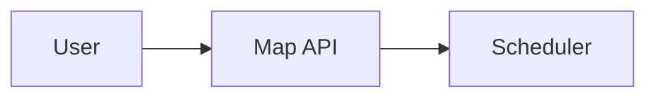

# 📊 Diagram Generation Guide

This guide explains how to create visual diagrams from the Mermaid text files in this project.

---

## 🎨 Available Diagrams

| Diagram | File | Description |
|---------|------|-------------|
| **Sequence (with Scheduler)** | `sequence-with-scheduler.mmd` | Full flow with green theme |
| **Architecture (Green)** | `architecture-green.mmd` | System architecture with green theme |
| **Architecture (Colorful)** | `architecture-colorful.mmd` | Multi-color architecture |
| **Smart Queue Flow** | `smart-queue-flow.mmd` | Queue degradation logic |
| **Research Pipeline** | `research-pipeline.mmd` | Research framework flow |

---

## 🌐 Online Tools to Render Diagrams

### 1️⃣ Mermaid Live Editor (RECOMMENDED)

**URL:** https://mermaid.live

**Steps:**
1. Go to https://mermaid.live
2. Delete the default code in the left panel
3. Copy the content from any `.mmd` file
4. Paste into the editor
5. The diagram renders instantly on the right
6. Click **"Download PNG"** or **"Download SVG"** at the top

**Features:**
- ✅ Real-time preview
- ✅ PNG/SVG export
- ✅ Shareable links
- ✅ Theme customization

---

### 2️⃣ Draw.io / Diagrams.net

**URL:** https://app.diagrams.net

**Steps:**
1. Go to https://app.diagrams.net
2. Click **"Create New Diagram"**
3. Select **"Blank Diagram"**
4. Go to **Arrange → Insert → Advanced → Mermaid**
5. Paste your Mermaid code
6. Click **"Insert"**
7. Export as PNG/SVG/PDF

**Features:**
- ✅ Edit after import
- ✅ Multiple export formats
- ✅ Google Drive integration
- ✅ Collaborative editing

---

### 3️⃣ Excalidraw

**URL:** https://excalidraw.com

**Steps:**
1. Go to https://excalidraw.com
2. Use the built-in shapes to recreate the diagram
3. Or use the **Mermaid to Excalidraw** plugin

**Features:**
- ✅ Hand-drawn aesthetic
- ✅ Collaborative
- ✅ Export to PNG/SVG

---

### 4️⃣ GitHub/GitLab Markdown Preview

If your repository is on GitHub or GitLab, Mermaid diagrams render automatically in Markdown:

```markdown

```

---

## 🖥️ Command Line Tools

### Install Mermaid CLI

```bash
# Install globally
npm install -g @mermaid-js/mermaid-cli

# Generate PNG
mmdc -i sequence-with-scheduler.mmd -o ../../assets/images/sequence-diagram.png -b white

# Generate SVG
mmdc -i architecture-green.mmd -o ../../assets/images/architecture.svg

# Generate PDF
mmdc -i sequence-with-scheduler.mmd -o ../../assets/images/sequence-diagram.pdf
```

### VS Code Extensions

Install **"Mermaid Preview"** extension:
1. Open VS Code/Cursor
2. Go to Extensions (Cmd+Shift+X)
3. Search "Mermaid Preview"
4. Install
5. Open any `.mmd` file
6. Press `Cmd+Shift+P` → "Mermaid: Preview"

---

## 📋 Quick Copy Commands (macOS)

```bash
# Copy sequence diagram to clipboard
cat docs/diagrams/sequence-with-scheduler.mmd | pbcopy

# Copy architecture diagram to clipboard
cat docs/diagrams/architecture-green.mmd | pbcopy
```

Then paste directly into https://mermaid.live

---

## 🎯 Whiteboard to Diagram Workflow

Based on your whiteboard sketch, here's the exact flow:

```
┌────────┐    ┌────────┐    ┌───────────┐    ┌─────────────┐
│  USER  │───>│  MAP   │───>│ SCHEDULER │───>│ ORCHESTRATOR│
│   👤   │    │  API   │    │    ⏱️     │    │     🎭      │
└────────┘    └────────┘    └───────────┘    └──────┬──────┘
                                                    │
                                    ┌───────────────┼───────────────┐
                                    │               │               │
                                    ▼               ▼               ▼
                              ┌─────────┐    ┌─────────┐    ┌─────────┐
                              │ Agent 1 │    │ Agent 2 │    │ Agent 3 │
                              │   🎬    │    │   🎵    │    │   📖    │
                              └────┬────┘    └────┬────┘    └────┬────┘
                                   │              │              │
                                   └──────────────┼──────────────┘
                                                  ▼
                                          ┌─────────────┐
                                          │ SMART QUEUE │
                                          │     🚦      │
                                          └──────┬──────┘
                                                 │
                                                 ▼
                                          ┌─────────────┐
                                          │   JUDGE     │
                                          │     ⚖️      │
                                          └──────┬──────┘
                                                 │
                                                 ▼
                                          ┌─────────────┐
                                          │  COLLECTOR  │
                                          │     📥      │
                                          └─────────────┘
```

---

## 🗂️ Code-to-Diagram Mapping

| Diagram Component | Source Code File | Class/Function |
|-------------------|------------------|----------------|
| **User** | `main.py` | Entry point |
| **Map API** | `src/services/google_maps.py` | `GoogleMapsClient`, `get_route()` |
| **Scheduler** | `src/core/timer_scheduler.py` | `TravelSimulator`, `start()` |
| **Orchestrator** | `src/core/orchestrator.py` | `PointProcessor`, `Orchestrator` |
| **Agent 1 (Video)** | `src/agents/video_agent.py` | `VideoAgent`, `execute()` |
| **Agent 2 (Music)** | `src/agents/music_agent.py` | `MusicAgent`, `execute()` |
| **Agent 3 (Text)** | `src/agents/text_agent.py` | `TextAgent`, `execute()` |
| **Smart Queue** | `src/core/smart_queue.py` | `SmartAgentQueue` |
| **Judge** | `src/agents/judge_agent.py` | `JudgeAgent`, `evaluate()` |
| **Collector** | `src/core/collector.py` | `ResultCollector` |

---

## 🎨 Green Theme Color Palette

The diagrams use this green palette matching the whiteboard:

| Color | Hex | Usage |
|-------|-----|-------|
| Dark Green | `#064e3b` | Background, dark boxes |
| Forest Green | `#065f46` | Clusters |
| Teal | `#047857` | Scheduler |
| Emerald | `#059669` | Orchestrator |
| Green | `#10b981` | Primary accent, borders |
| Light Green | `#34d399` | Secondary elements |
| Pale Green | `#6ee7b7` | Tertiary elements |
| Mint | `#a7f3d0` | Collector |
| White Green | `#d1fae5` | Notes |
| Off White | `#ecfdf5` | Text on dark |

---

## 📸 Saving Diagrams for README

After generating, save to:
```
assets/images/
├── architecture-overview.png     # Main architecture
├── Sequence-Diagram.png          # Full sequence with scheduler
├── smart-queue-flow.png          # Queue degradation
└── research-pipeline.png         # Research framework
```

Then reference in README:
```markdown

```

